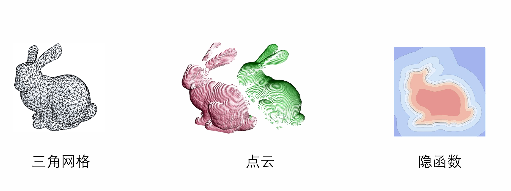
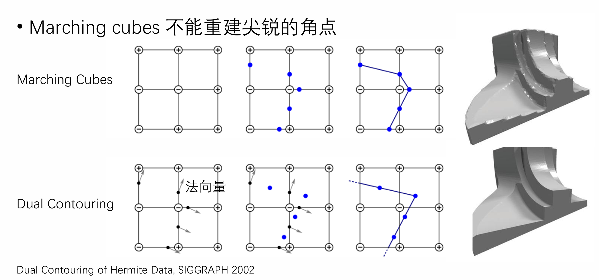
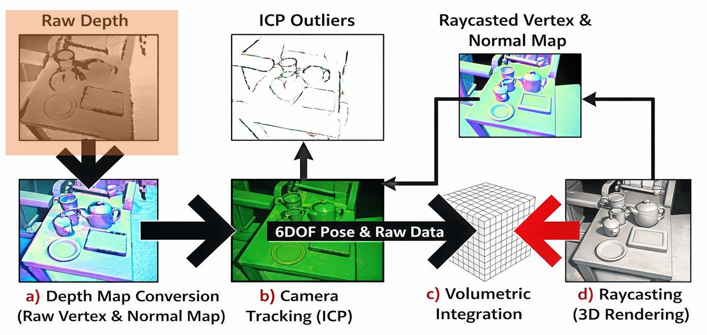
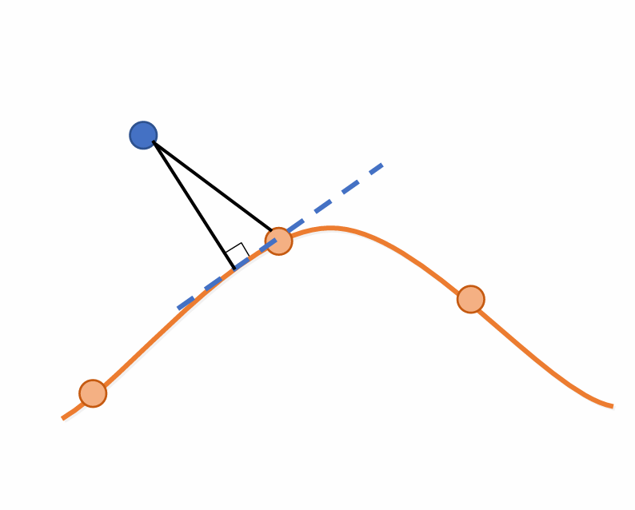
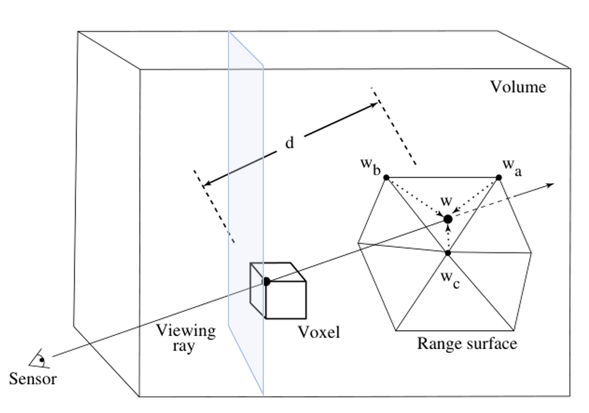
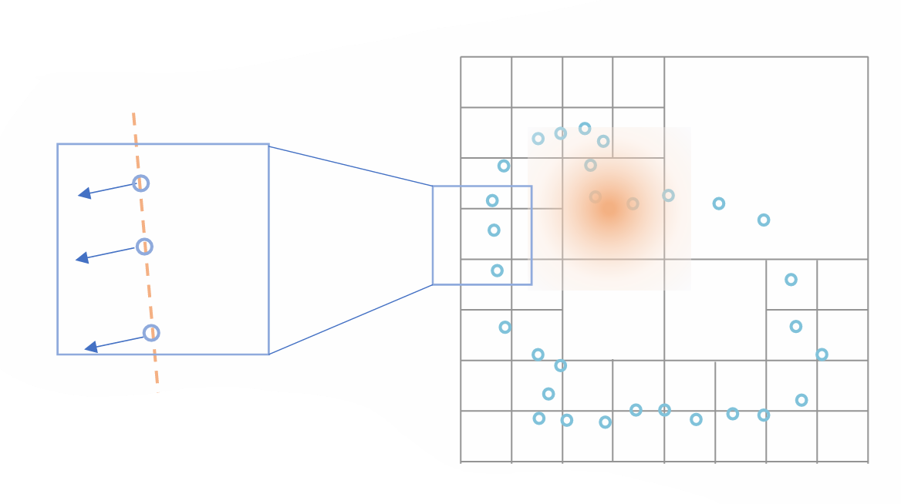

## 几何表达及其相互转换

主要介绍三种常见的三维数据表达方式，以及它们之间的部分相互转换方法。

### 三角网格
* **基本表达**：由顶点（包含 $x, y, z$ 坐标）和三角形（包含顶点的索引 $i, j, k$）组成。
* **法向量计算**：面法向量通过三角形两边的向量叉乘得到；点法向量则是由相邻面法向量按面积加权平均求得。三角形内部任意一点的法向量可以通过重心坐标插值求出。
* **数据结构**：为了快速查询任意顶点的邻域，通常使用以边为中介的半边数据结构。
* **几何变换**：
    * 刚体变换（Rigid）：包含平移和旋转，保持长度不变。
    * 相似变换（Conformal）：包含平移、旋转和等比例缩放，保持角度不变。
    * 仿射变换（Affine）：包含平移、旋转、缩放、对称和错切，保持共线关系。
    * **法向量的变换**：经过矩阵 $M$ 变换后，新法向量的计算公式需要用到**逆转置矩阵**：$N_t = M^{-T}N_o$。

### 点云
* **基本表达**：最基础的表达是 xyz 格式的顶点列表。这通常是三维扫描仪的直接输出格式。
* **法向量估计**：可以从点云的局部利用主成分分析（PCA）进行估计。通过计算协方差矩阵，其最小特征值对应的特征向量即为法向量。

### 隐函数
* **基本表达**：用函数的等值面（如 $f(x,y,z)=0$）来表达一个三维形状。例如符号距离场（SDF）。
* **法向量计算**：隐函数 $F(x,y,z)=0$ 的法向量即为该函数的梯度方向：$n = \nabla F / ||\nabla F||$。
* **布尔运算 (CSG)**：隐函数非常便于进行布尔运算，如并集 $\min(f_1, f_2)$、交集 $\max(f_1, f_2)$ 和差集 $\max(f_1, -f_2)$。

### 三维表达之间的转换 
* **隐函数转三角形网格**：常用 Marching Cubes 算法，该算法对三维空间均匀采样并通过查表得到三角化结果，但它的缺点是不能重建尖锐的角点。改进方法有 Dual Contouring。

* **三角形网格转隐函数**：通过计算空间点到三角形的最短距离来获取隐函数值。可以通过射线与三角形网格交点的奇偶性来判断点是在网格内部（奇数交点）还是外部（偶数交点）。

## 曲面重建 

以 KinectFusion 为例子，探讨了如何从深度传感器的数据重建出三维模型。

### 三维扫描技术原理 
* **Kinect V1**：主要利用结构光（Structured Light）原理，硬件包含红外投影器、RGB 相机和红外相机。
* **Kinect V2**：利用飞行时间（Time Of Flight, TOF）原理，通过测量光的传播时间来计算距离，反映在信号上即为相位的变化。

### 从深度图到三维数据 
* **深度图转点云**：利用相机的内参数矩阵（Camera Intrinsics，包含焦距和主点坐标），通过投影变换的逆过程将深度图的像素点转换到世界坐标系下。
* **获取法向量**：通过建立邻域关系先构建三角形网格，进而为每个三角形计算法向量。

### 点云配准与 ICP 算法 
* **配准目标**：给定两组存在对应关系的点云 $P$ 和 $Q$，求解出一个旋转矩阵 $R$ 和平移向量 $t$，使得误差 $\sum_i w_i ||Rq_i + t - p_i||^2$ 最小。
* **平移的求解**：最优的平移向量可以通过两组点云的加权质心求得，即 $t = \overline{q} - R\overline{p}$。
* **旋转的求解**：将上述求得的 $t$ 带入，下面目标是最小化两组点云旋转后的加权欧氏距离平方和，其数学表达为：

  $$
  R = \arg\min_R \sum_{i=1}^{n} w_i \|R x_i - y_i\|^2
  $$
  约束条件：
  $$
  s.t. \quad R^T R = I
  $$

  这个优化问题在数学上被称为 [Orthogonal Procrustes problem](https://en.wikipedia.org/wiki/Orthogonal_Procrustes_problem)。

  **求解方法**：奇异值分解 (SVD)
  * 计算协方差矩阵 $S$利用中心化后的两组点云矩阵 $X$ 和 $Y$，以及权重矩阵 $W$，计算它们之间的交叉协方差矩阵 $S$：
    $$
    S = XWY^T
    $$
    紧接着，对矩阵 $S$ 进行奇异值分解：
    $$
    S = U \Sigma V^T
    $$
  * 构造旋转矩阵 $R$利用 SVD 分解得到的正交矩阵 $U$ 和 $V$，可以求得最优旋转矩阵 $R$：
  $$
  R = V \begin{pmatrix} 1 & & & \\ & \ddots & & \\ & & 1 & \\ & & & \det(VU^T) \end{pmatrix} U^T
  $$

* **迭代最近点 (ICP) 算法**：
    * 由于一开始不知道点云的对应关系，ICP 采用迭代的方法：1. 查询最近点建立对应关系；2. 根据对应关系求解当前的旋转 $R$ 和平移 $t$，不断循环直到收敛。
    * **算法改进**：
      * 改进一：考虑法向量  
        **公式**：
        $$
        \min_{R,t} \sum_i w_i \|\mathbf{n}^T (Rq_i + t - C(P, q_i))\|^2
        $$
        优化目标从“点到点的斜线距离”变成了“点到切平面的垂直距离”。

        

      * 改进二：剔除错误匹配点

### TSDF (截断符号距离场)

如果直接对三维空间每个点，都计算到曲面的距离，开销太大，难以做到实时，但我们一般只关注到曲面距离在 $0$ 附近的，下面介绍更高效的方法。

TSDF 是一种隐式表达三维表面的方法。它将三维空间划分为均匀的网格（体素），每个体素存储着该点到最近表面的距离（SDF）以及置信度权重。

* 单帧点云 $\rightarrow$ TSDF (初始化)  
  在拿到单帧深度图/点云后，需要将其转化为 TSDF 空间：
  * **TSDF 距离值 $d_i(\mathbf{x})$**：
      * 从相机传感器发出一条穿过当前体素 $\mathbf{x}$ 的射线，打到观测到的表面（三角网格）上。
      * 计算体素到表面的距离。为了抵御远处的噪声，引入**截断（Truncation）**机制：只在表面附近的一个规定阈值范围内保留真实的距离值，超出这个范围的距离会被截断为一个常数。
  * **置信度权重 $w_i(\mathbf{x})$**：
      * 表示该体素距离值的可靠程度。
      * 靠近表面的区域，权重通过在三角形上插值计算得出；而在被截断的部分（即远离曲面的区域），其 SDF 是不可信的，因此**截断部分的置信度设为 0**。
  * **计算优化**：由于每个体素的计算是相互独立的，因此三维体素可以进行**分层并行计算**（适合 GPU 加速）。

  

* 多帧 TSDF 融合 (Integration)  
  在相机的连续运动中，我们会得到多帧不同的 TSDF 数据。我们需要将新的一帧 $i+1$ 融合到已有的全局模型 $i$ 中。
  * **融合策略：加权平均**
      * 通过加权平均不断更新全局体素的距离值 $D(\mathbf{x})$ 和权重 $W(\mathbf{x})$。这种方式能极其有效地平滑掉单帧深度图带来的传感器噪声。
  * **更新公式**：
      * **距离更新**：
        $$
        D_{i+1}(\mathbf{x}) = \frac{W_i(\mathbf{x})D_i(\mathbf{x}) + w_{i+1}(\mathbf{x})d_{i+1}(\mathbf{x})}{W_i(\mathbf{x}) + w_{i+1}(\mathbf{x})}
        $$
      * **权重累加**：
        $$
        W_{i+1}(\mathbf{x}) = W_i(\mathbf{x}) + w_{i+1}(\mathbf{x})
        $$
  * **零交叉点 (Zero-crossing)**：在加权平均的过程中，物体表面的实际位置（即 SDF 从正变负的 $D=0$ 的等值面）会被不断修正，最终逼近真实的物理表面。

* TSDF 用于形状补全 (Shape Completion)  
  在真实扫描中，由于视角的限制，物体总会有被遮挡的背面或死角（形成孔洞）。TSDF 的空间划分特性可以天然地辅助进行孔洞修补。
* 可视化  
  在扫描过程中，可以实时用 Ray Casting 进行三维渲染。

### 函数拟合

* **局部拟合**  
  首先使用空间划分数据结构（如四叉树/八叉树），将整体大空间切割成众多局部网格。在每一个局部网格内，点云的分布相对简单，可以使用基础的数学函数进行拟合。

  最小二乘局部拟合（以二维为例）
  最简单的局部表面可以假设为一条直线或一个平面（一次函数）：
  $$
  f(x,y)=ax+by+c
  $$

  为了找到最贴合当前局部点云的平面，使用最小二乘法求解以下目标函数：
  $$
  \min_{a,b,c}\sum_i(ax_i+by_i+c)^2+\lambda\sum_i\|(n_i^x,n_i^y)-(a,b)\|^2
  $$

  $\lambda\sum_i\|(n_i^x,n_i^y)-(a,b)\|^2$ 要求拟合平面的法向量 $(a,b)$ 尽可能与已知数据点的法向量保持一致。$\lambda$ 是用于平衡这两种约束的权重参数。

  如果局部形状略微弯曲，一次函数可能不够精确，此时也可以使用二次函数来捕获更好的局部细节：
  $$
  f(x,y)=ax^2+by^2+cxy+dx+ey+f
  $$

  

  各个局部网格独立完成拟合后，如果直接拼在一起，边界处会产生不连续的断层或棱角。为了实现无缝拼接，引入了 **Partition of Unity (PoU)** 原理。

  算法为每个局部拟合函数 $f_k(x,y)$ 分配一个平滑的权重函数 $w_k(x,y)$。规则通常是：越靠近该局部区域的中心，权重越接近1；越靠近网格边缘，权重平滑递减至0。

  空间中任意一点的最终整体形状 $F(x,y)$，由覆盖该点的所有局部拟合函数“加权平均”共同决定：
  $$
  F(x,y)=\frac{\sum w_k(x,y)f_k(x,y)}{\sum w_k(x,y)}
  $$
* **全局拟合**：Poisson 重建  
  首先需要明确两个关键的数学函数：

  * **向量场 $\vec{V}(p)$：**
      * 映射关系：$\vec{V} : \mathbb{R}^3 \to \mathbb{R}^3$
      * **物理意义：** 由输入点云的法向量推导计算出来的空间梯度场。
  * **指示函数 $\chi(p)$ (Indicator Function)：**
      * 映射关系：$\chi : \mathbb{R}^3 \to \mathbb{R}$
      * **物理意义：** 这是一个用来区分“模型内部”和“模型外部”的标量函数。通常定义模型**内部为 0，外部为 1**。

  由于输入数据只有点云和法向量，我们实际上只知道表面的“梯度”（即法向量场 $\vec{V}$）。我们需要根据这个梯度场反推出整个空间的指示函数 $\chi$。

  * **目标能量函数 (Energy Function)：**
      为了找到最符合已知法向量的表面，我们需要寻找一个指示函数 $\chi$，使得它的梯度 $\nabla \chi$ 尽可能逼近已知的向量场 $\vec{V}$。这转化为一个最小二乘极值问题：
      $$
      E(\chi) = \int \|\nabla \chi(p) - \vec{V}(p)\|^2 dp
      $$

  * **转化为泊松方程 (Poisson Equation)：**
      直接求解上述积分函数的最小值比较困难。根据变分法中的 **Euler-Lagrange 公式**，能量函数 $E(\chi)$ 取得最小值时，必然满足以下偏微分方程：
      $$
      \Delta \chi \equiv \nabla \cdot \nabla \chi = \nabla \cdot \vec{V}
      $$
      *(注：$\Delta$ 是拉普拉斯算子，$\nabla \cdot$ 是散度算子。即要求未知函数 $\chi$ 的拉普拉斯值等于已知向量场 $\vec{V}$ 的散度。)*
