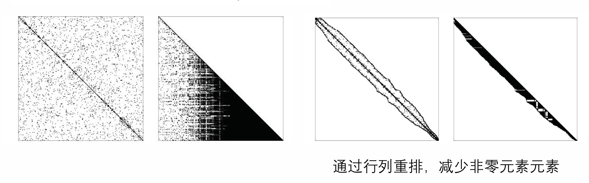
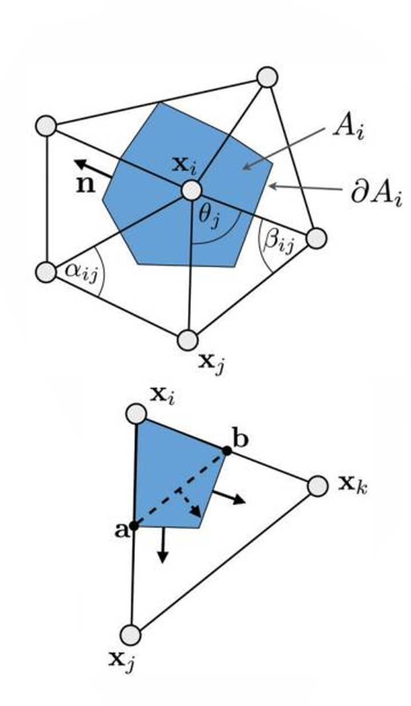
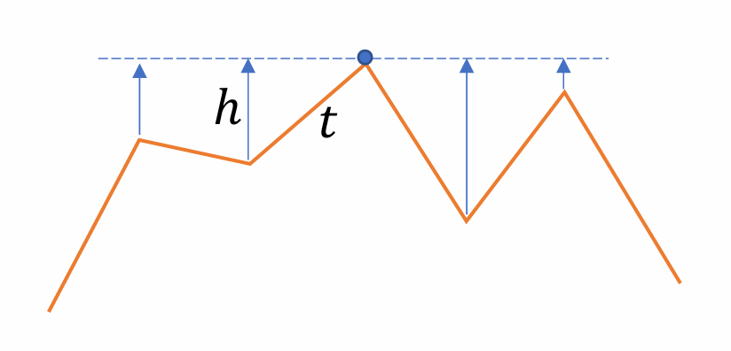

## 数学基础
### 散度定理
函数 $\mathbf{F} = (P, Q, V)$
$$
\oint_{\partial V} \mathbf{F} \cdot d\mathbf{S} = \int_{V} \nabla \cdot \mathbf{F} \, dV
$$
$$
\oint_{\partial V} P \, dydz + Q \, dxdz + V \, dxdy = \int_{V} \left( \frac{\partial P}{\partial x} + \frac{\partial Q}{\partial y} + \frac{\partial V}{\partial z} \right) dV
$$

### 梯度与拉普拉斯算子
为了描述空间中温度的变化，引入了两个重要的数学算子：

**温度差**（梯度 $\nabla u$）：
$$
\nabla u = \left( \frac{\partial u}{\partial x}, \frac{\partial u}{\partial y}, \frac{\partial u}{\partial z} \right)
$$
梯度代表了温度变化最剧烈的方向。热量总是沿着梯度的反方向（从高温到低温）流动的。

**拉普拉斯算子** ($\Delta u$ 或 $\nabla^2 u$)：$\Delta u = \nabla \cdot (\nabla u)$，即梯度的散度。它描述了空间某点温度的“不均匀性”或“平均差”。

### 热传播方程：

通过**散度定理**，我们可以把曲面上的热通量转化成体积内的变化：

1.  **左侧（流出量）**：利用散度定理，将闭合曲面上的温度梯度积分转化为体积积分：
    $$
    \oint_{\partial V} \nabla u \cdot d\mathbf{S} = \int_{V} \nabla \cdot \nabla u \, dV = \int_{V} \Delta u \, dV
    $$
2.  **右侧（变化量）**：根据物理定律，内部热量的变化与温度随时间的变化率 $\frac{\partial u}{\partial t}$ 相关：
    $$
    \lambda \int_{V} \frac{\partial u}{\partial t} \, dV
    $$
3.  **最终方程**：由于上述等式对任意体积 $V$ 都成立，消去积分号得到**热传播方程**：
    $$
    \Delta u(\mathbf{x}, t) = \lambda \frac{\partial u(\mathbf{x}, t)}{\partial t}
    $$

### 图上的微分算子

我们将三维空间中的函数简化为定义在图 $G = (V, E)$ 上的函数。
* **$V$ (Vertices)**：顶点，相当于空间中的采样点。
* **$E$ (Edges)**：边，代表点与点之间的邻接关系。
* **$f_i$**：定义在顶点 $v_i$ 上的标量值（例如该点的温度、高度或颜色）。

**图上的梯度**
在连续空间，梯度描述函数值的变化。在图上，梯度定义在**边** $e_{ij}$ 上：
$$
\nabla G |_{e_{ij}} = f_i - f_j
$$
* **物理意义**：它表示两个相邻顶点之间值的“势差”。

### 图上的拉普拉斯算子
通过“热传播”的视角，我们可以推导出顶点 $v_i$ 处的离散拉普拉斯算子：
$$
\Delta G |_{v_i} = \frac{1}{N_i} \sum_{j \in Neigh_i} (f_j - f_i)
$$
* **$Neigh_i$**：顶点 $v_i$ 的所有邻居节点。
* **$N_i$**：邻居节点的数量（度数）。
* **直观理解**：它计算的是**该点值与周围邻居平均值的差**。如果 $\Delta G > 0$，说明该点比周围“冷”；如果 $\Delta G < 0$，说明该点比周围“热”。

## 拉普拉斯平滑

平滑一个 3D 模型（网格）的过程，在数学上等同于让模型上的点坐标按照**扩散方程（Diffusion Equation）**进行演化。
* **方程**：$\frac{\partial}{\partial t} f(v_i, t) = \lambda \Delta f(v_i, t)$
* **离散近似**：$\frac{\partial \mathbf{f}(t)}{\partial t} \approx \frac{\mathbf{f}(t+h) - \mathbf{f}(t)}{h}$
* **直观理解**：网格上的每一个点 $v_i$ 都会向其邻居的平均位置移动。随着时间 $t$ 的推移，尖锐的噪点会被“抹平”，模型变得圆润。

为了在计算机上实现这个方程，我们需要将连续的时间微分 $\frac{\partial f}{\partial t}$ 离散化。

* **方案 A：前向欧拉法**
    这是最直接的方法，使用**当前时刻**的状态来预测下一时刻。
    * **迭代公式**：$\mathbf{f}^k = \mathbf{f}^{k-1} + \tau \mathbf{L} \mathbf{f}^{k-1}$

* **方案 B：后向欧拉法 (Implicit/Backward Euler)**
    这是一种“隐式”方法，使用**下一时刻**的状态来更新。
    * **迭代公式**：$(\mathbf{I} - \tau \mathbf{L}) \mathbf{f}^k = \mathbf{f}^{k-1}$

**求解** $(I - \tau \mathbf{L})\mathbf{f}^k = \mathbf{f}^{k-1}$  (求解 $Ax = b$) 的方法：

**Cholesky 分解** ($LL^T$)

当矩阵 $A$ 是**对称正定**的时，$LU$ 分解可以进一步简化为 $LL^T$。
* **公式**：$A = LL^T$
* **求解步骤**：
    1.  先解 $Ly = b$（前向替换）。
    2.  再解 $L^Tx = y$（后向替换）。
* **技巧**：
    对于这里的矩阵，他极大概率是稀疏的，直接分解对内存的开销过大。使用重排的方法把非零元集中到对角线附近，可以大大减少分解时产生的非零元。

## 三角形网格

在网格中，我们只知道顶点 ($v_i, v_j, v_k$) 上的值 $f_i, f_j, f_k$。为了计算三角形内部任意点 $x$ 的值，我们需要使用**重心坐标插值 (Barycentric Interpolation)**：

$$
f(x) = B_i(x)f_i + B_j(x)f_j + B_k(x)f_k
$$

* **$B_i(x)$**：线性基函数（或者叫插值权重）。它的特点是在顶点 $i$ 处为 $1$，在其他顶点处为 $0$，且在三角形内部线性变化。

* 基函数的梯度

    因为 $B_i(x)$ 是一个线性函数，它的梯度 $\nabla B_i(x)$ 是一个**常数向量**。

* **几何意义**：$\nabla B_i(x)$ 的方向垂直于对边（即边 $e_{jk}$），且大小与三角形的面积 $A_T$ 成反比。
* **公式表达**：$\nabla B_i(x) = \frac{(x_k - x_j)^\perp}{2A_T}$。这里的 $^\perp$ 表示将向量旋转 $90^\circ$（法向方向）。

* **三角形梯度公式**
    将基函数的梯度代入插值公式，我们得到整个三角形面片上的**梯度向量**：

    $$
    \nabla f(x) = (f_j - f_i) \frac{(x_i - x_k)^\perp}{2A_T} + (f_k - f_i) \frac{(x_j - x_i)^\perp}{2A_T}
    $$

* **三角形网格内的拉普拉斯算子**
    根据上面的梯度公式，我们可以推导出顶点的拉普拉斯算子：

    根据散度定理

    $$
    \int_{A_i} \Delta f(\mathbf{u}) \, dA = \int_{A_i} \text{div} \nabla f(\mathbf{u}) \, dA = \int_{\partial A_i} \nabla f(\mathbf{u}) \cdot \mathbf{n}(\mathbf{u}) \, ds
    $$
    其中 $A_i$ 是顶点 $v_i$ 周围的对偶区域，$\mathbf{n}$ 是边界法向量。

    单个三角形内的通量积分

    针对 $\partial A_i \cap T$（即落在某个三角形 $T$ 内的那部分对偶边界）进行计算：
    $$
    \int_{\partial A_i \cap T} \nabla f(\mathbf{u}) \cdot \mathbf{n}(\mathbf{u}) \, ds = \nabla f(\mathbf{u}) \cdot (\mathbf{a} - \mathbf{b})^\perp = \frac{1}{2} \nabla f(\mathbf{u}) \cdot (\mathbf{x}_j - \mathbf{x}_k)^\perp
    $$
    代入梯度公式进一步推导得到：
    $$
    = (f_j - f_i) \frac{(\mathbf{x}_i - \mathbf{x}_k)^\perp \cdot (\mathbf{x}_j - \mathbf{x}_k)^\perp}{4A_T} + (f_k - f_i) \frac{(\mathbf{x}_j - \mathbf{x}_i)^\perp \cdot (\mathbf{x}_j - \mathbf{x}_k)^\perp}{4A_T}
    $$
    利用向量点积与余切值的几何关系简化为：
    $$
    = \frac{1}{2} \left( \cot \gamma_k (f_j - f_i) + \cot \gamma_j (f_k - f_i) \right)
    $$
    离散拉普拉斯算子最终公式 (Discrete Laplacian)

    将周围所有邻接三角形的贡献加总，得到顶点 $v_i$ 处的余切权重公式：
    $$
    \Delta f(v_i) := \frac{1}{2A_i} \sum_{v_j \in \mathcal{N}_1(v_i)} (\cot \alpha_{i,j} + \cot \beta_{i,j}) (f_j - f_i)
    $$
    $A_i$：顶点 $v_i$ 的对偶区域面积（混合面积）。$\mathcal{N}_1(v_i)$：顶点 $v_i$ 的一阶邻域（即所有相连的邻居点）。$\alpha_{i,j}, \beta_{i,j}$：共享边 $(v_i, v_j)$ 的两个相邻三角形中，与该边相对的两个内角。$(f_j - f_i)$：相邻顶点间的函数值差。

    

    **由此求得的拉普拉斯矩阵，也可以用于[拉普拉斯平滑](#拉普拉斯平滑)的计算。**

## 双边网格去噪

**核心算法流程：**
* **输入**：顶点 $\mathbf{v}$，该点法向量 $\mathbf{n}$。
* **高度图概念**：将每个顶点周围的邻居点投影到法向量方向上，转化成一个局部“高度”。
* **关键变量推导**：
    * $t = \|\mathbf{v} - \mathbf{q}_i\|$：邻居点与当前点的**欧几里得距离**。
    * $h = \langle \mathbf{n}, \mathbf{v} - \mathbf{q}_i \rangle$：邻居点相对于中心点的**法向偏移量（高度差）**。
* **双边权重组合**：
    * $w_c = \exp(-t^2 / (2\sigma_c^2))$：对应空间距离（控制平滑范围）。
    * $w_s = \exp(-h^2 / (2\sigma_s^2))$：对应高度差异（**保边核心**：如果高度差太大，权重变极小）。

* **更新公式**：
$$
\mathbf{\hat{v}} = \mathbf{v} + \mathbf{n} \cdot \left( \frac{\sum w_c w_s h}{\sum w_c w_s} \right)
$$

## 法向量双边滤波

**第一步：法向量滤波**。先不管顶点坐标，只对面片的法向量进行双边滤波。

处理的对象变成了**法向量 $\mathbf{n}$**：
$$
\mathbf{n}_i^{k+1} = \frac{1}{K_i} \sum_j W_{\sigma_s}(\dots) \cdot W_{\sigma_r}(\|\mathbf{n}_i^k - \mathbf{n}_j^k\|) \cdot \mathbf{n}_j^k
$$
* **优点**：如果两个相邻面片分别属于两个不同的平面（如立方体的顶面和侧面），它们的法向量差别很大。值域权重 $W_{\sigma_r}$ 会识别出这种巨大差异并停止平滑，从而保持尖锐特征（Sharp Features）。

**第二步：更新顶点位置**。根据平滑后的法向量，反过来调整顶点坐标，使三角形面片重新对齐这些法向量。

* **几何约束**
一个面片的法向量 $\mathbf{n}_f$ 必须垂直于该三角形的所有边：
$$\mathbf{n}_f \cdot (\mathbf{x}_j - \mathbf{x}_i) = 0$$

* **能量函数最小化**
为了让所有顶点尽可能满足上述约束，定义能量函数（误差总和）：
$$
e_1(X) = \sum_{k \in F} \sum_{(i,j) \in \partial F_k} (\mathbf{n}_k' \cdot (\mathbf{x}_i - \mathbf{x}_j))^2
$$

* **梯度下降法求解**
利用梯度下降法不断迭代顶点位置，直到误差最小：
$$
\mathbf{x}_i' = \mathbf{x}_i + \lambda \sum_{j \in N_V(i)} \sum_{(i,j) \in \partial F_k} \mathbf{n}_k' (\mathbf{n}_k' \cdot (\mathbf{x}_j - \mathbf{x}_i))
$$

## 稀疏优化

* **目标**：使图像或网格的**梯度尽可能稀疏**。下面先看图像。
* **数学表达**：$\min_c |c - c^*|^2 + \lambda |\nabla c|_0$
    * $|c - c^*|^2$：**数据项**，保证平滑后的结果不能偏离原图太远。
    * $|\nabla c|_0$：**稀疏项（$L_0$ 范数）**，统计梯度不为 0 的像素点个数。越小代表平面越多，边缘越锐利。

**算法实现：交替方向乘子法 (ADMM 思想)**

由于 $L_0$ 范数是不可导的（NP-hard 问题），我们可以通过引入**辅助变量** $\delta$ 来求解：

1.  **拆解方程**：将原问题转化为 $\min_{c, \delta} |c - c^*|^2 + \beta |\nabla c - \delta|^2 + \lambda |\delta|_0$。
2.  **固定 $c$，更新 $\delta$ (Local Step)**：这是一个硬阈值操作。如果梯度不够大，直接砍成 0；如果够大，保留原样。
3.  **固定 $\delta$，更新 $c$ (Global Step)**：这是一个全局优化问题，通常转化为解线性方程组。

将此技术应用到 3D 网格时，面临一个问题：**如何定义网格上的“梯度”或“拉普拉斯”？**

直接用“点的拉普拉斯”会导致模型像被抽真空一样严重收缩，且棱角依然不清晰。

* **边上的拉普拉斯算子 $D(e)$**：

    2013 年的研究（如 $L_0$ Mesh Smoothing）将关注点从**点**移到了**边**。

    算子定义在共享边 $e$ 的两个三角形上，涉及四个顶点：
    * **$p_1, p_3$**：共享边 $e$ 的两个端点。
    * **$p_2, p_4$**：分别属于两个三角形的相对顶点。

    与之对应的有四个关键角度：$\theta_{2,3,1}, \theta_{1,3,4}, \theta_{3,1,2}, \theta_{4,1,3}$（即每个三角形内靠近共享边端点的内角）。

    边上的拉普拉斯算子 $D(e)$ 是一个线性算子，将四个顶点的坐标映射为一个标量值（代表该边的“翻折”或“非平坦”程度）：

    $$
    D(e) = \begin{bmatrix} 
    -\cot(\theta_{2,3,1}) - \cot(\theta_{1,3,4}) \\
    \cot(\theta_{2,3,1}) + \cot(\theta_{3,1,2}) \\
    -\cot(\theta_{3,1,2}) - \cot(\theta_{4,1,3}) \\
    \cot(\theta_{1,3,4}) + \cot(\theta_{4,1,3}) 
    \end{bmatrix}^T \begin{bmatrix} p_1 \\ p_2 \\ p_3 \\ p_4 \end{bmatrix}
    $$

    在 $2013$ 年的论文中，这个算子被放入 $L_0$ 范数中：
    $$
    \min_{p} |p - p^*|^2 + \lambda |D(p)|_0
    $$

## 基于机器学习的网格去噪

* **设计并提取特征**
    * **特征来源：多尺度法向量双边滤波**
        之前的双边滤波需要人工指定参数 $\sigma_s$ (空间) 和 $\sigma_r$ (值域)。这里的方法是多尝试。
        * 设置迭代次数 $k=1$（只做一次滤波）。
        * 均匀采样 10 组不同的 $(\sigma_s, \sigma_r)$ 参数对。
        * 分别用这 10 组参数对法向量进行双边滤波，得到 10 个不同的滤波结果。
    * **特征拼接 ($S_i$)**：
        将这 10 个滤波后的法向量拼接成一个长向量 $S_i = (n_i^1(\sigma_{s1}, \sigma_{r1}), \dots, n_i^1(\sigma_{sk}, \sigma_{rk}))$。
    * **旋转不变性 (Rotation Invariance)**：
        为了让神经网络不被物体的摆放姿势干扰，需要对齐主方向，确保无论模型怎么转，提取出的特征 $S_i$ 都是一样的。

* **回归模型建构**
有了特征 $S_i$（输入 X），我们需要训练一个网络，让它输出理想的、干净的法向量（输出 Y）。

    * **回归函数 $F(S_i; \Theta)$**：
        * 这里使用了一个**单隐层神经网络 (Single-hidden-layer Neural Network)**，$\Theta$ 代表网络的权重参数。
    * **损失函数 / 优化目标**：
        $$\min_\Theta \sum_i \|F(S_i; \Theta) - n_i^g\|_2^2$$
        * $n_i^g$：代表 **Ground Truth (理想的真实法向量)**。
        * **目标**：不断调整网络参数 $\Theta$，使得网络预测出的法向量，尽可能逼近干净无噪声的真实法向量。
    * **高阶技巧：基于聚类的回归**
        * **做法**：不训练一个万能的巨型网络，而是**给每个类别单独训练一个小神经网络**。
        * **优势**：降低了训练难度。处理平面的“专家”网络只管把面抹平，处理边缘的“专家”网络只管保护锐利度。类似于 **MoE (Mixture of Experts)** 架构。
