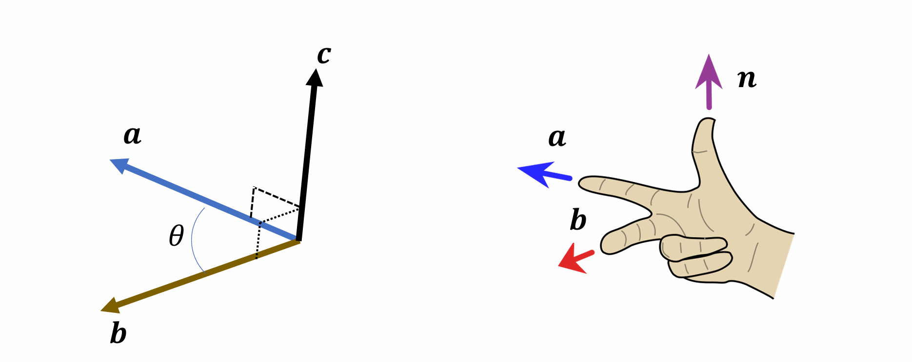
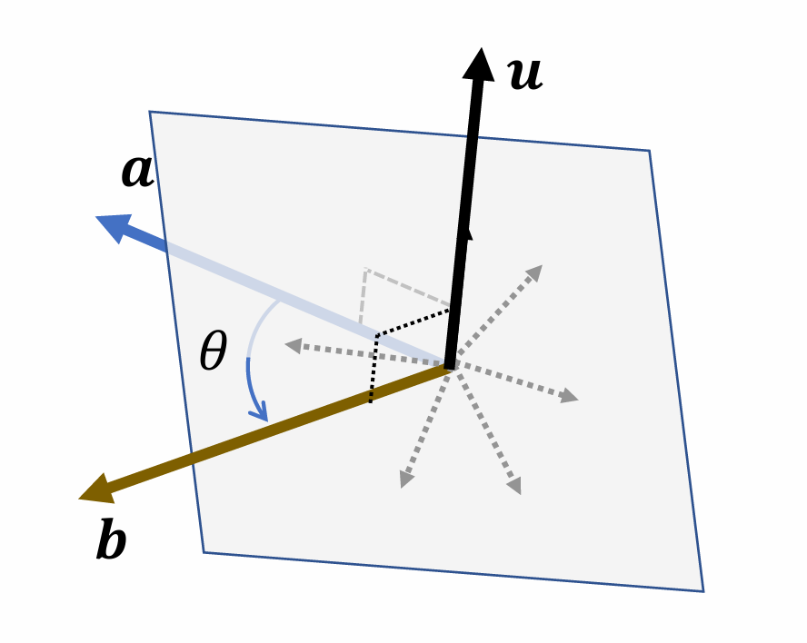
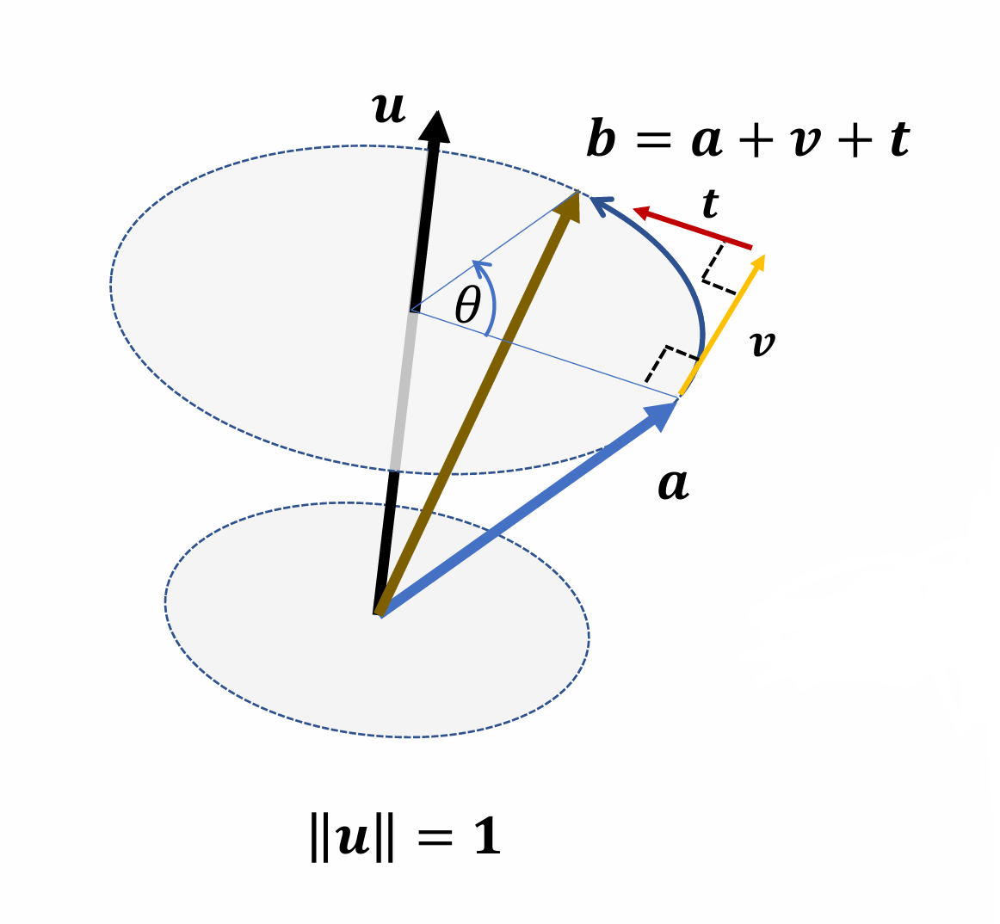

## 三维向量

### 叉乘
$$\mathbf{c} = \mathbf{a} \times \mathbf{b} = \begin{bmatrix} a_y b_z - a_z b_y \\ a_z b_x - a_x b_z \\ a_x b_y - a_y b_x \end{bmatrix} \implies \mathbf{c} = \mathbf{a} \times \mathbf{b} = \|\mathbf{a}\| \|\mathbf{b}\| \sin(\theta) \mathbf{n}$$

### 最小（角度）旋转
- **旋转轴 (Rotation axis):**

$$
\mathbf{u} = \frac{\mathbf{a} \times \mathbf{b}}{\|\mathbf{a} \times \mathbf{b}\|}
$$

通过向量 $\mathbf{a}$ 和 $\mathbf{b}$ 的叉乘并归一化，得到垂直于两者所在平面的单位向量作为旋转轴。
- **旋转角度 (Rotation angle):**

$$
\theta = \arg \cos \frac{\mathbf{a} \cdot \mathbf{b}}{\|\mathbf{a}\| \|\mathbf{b}\|}
$$

通过向量的点积公式计算出 $\mathbf{a}$ 和 $\mathbf{b}$ 之间的夹角。

### 罗德里格旋转公式

已知单位旋转轴 $\mathbf{u}$ ($\|\mathbf{u}\| = 1$)，向量 $\mathbf{a}$ 绕该轴旋转角度 $\theta$ 得到向量 $\mathbf{b}$。

- **分量定义：**
- $\mathbf{v} = (\sin \theta) \mathbf{u} \times \mathbf{a}$
- $\mathbf{t} = (1 - \cos \theta) \mathbf{u} \times (\mathbf{u} \times \mathbf{a})$

* **向量合成：**

$$
\mathbf{b} = \mathbf{a} + \mathbf{v} + \mathbf{t}
$$

* **完整公式：**

$$
\mathbf{b} = \mathbf{a} + (\sin \theta) \mathbf{u} \times \mathbf{a} + (1 - \cos \theta) \mathbf{u} \times (\mathbf{u} \times \mathbf{a})
$$

### 叉乘的矩阵形式
将向量 $\mathbf{a}$ 与 $\mathbf{b}$ 的叉乘表示为矩阵与向量的乘积：
$$
\mathbf{c} = \mathbf{a} \times \mathbf{b} = \begin{bmatrix} a_y b_z - a_z b_y \\ a_z b_x - a_x b_z \\ a_x b_y - a_y b_x \end{bmatrix} = \begin{bmatrix} 0 & -a_z & a_y \\ a_z & 0 & -a_x \\ -a_y & a_x & 0 \end{bmatrix} \begin{bmatrix} b_x \\ b_y \\ b_z \end{bmatrix} = [\mathbf{a}]_{\times} \mathbf{b}
$$

由此，我们也可以把罗德里格公式写成如下形式：
$$
\begin{aligned}
\mathbf{b} &= \left( I + (\sin \theta) [\mathbf{u}]_{\times} + (1 - \cos \theta) [\mathbf{u}]_{\times}^2 \right) \mathbf{a} \\
&= R \mathbf{a}
\end{aligned}
$$

### 叉乘的行列式表示法

利用标准正交基向量 $\mathbf{i}, \mathbf{j}, \mathbf{k}$，可以将两个 3D 向量的叉乘写成行列式的形式：

$$
\begin{aligned}
\mathbf{c} = \mathbf{a} \times \mathbf{b} &= \begin{bmatrix} a_y b_z - a_z b_y \\ a_z b_x - a_x b_z \\ a_x b_y - a_y b_x \end{bmatrix} \\
&= \det \begin{bmatrix} \mathbf{i} & \mathbf{j} & \mathbf{k} \\ a_x & a_y & a_z \\ b_x & b_y & b_z \end{bmatrix}
\end{aligned}
$$

## 刚体变换
指不改变物体形状和大小，只改变其位置和取向的变换。它由以下两种基本变换组合而成：

- **平移:** 物体沿特定方向移动，所有点的位移矢量相同。
- **旋转:** 物体绕空间中某一点或轴线转动。

可以用矩阵表示，注意旋转矩阵是正交矩阵，旋转矩阵的行列式始终为 $+1$。如果行列式为 $-1$，则表示包含了一个“镜像反射”，那就不再是纯粹的旋转了。

## 旋转矩阵的特征值与旋转轴

旋转矩阵 $R$ 拥有一个实特征值 $+1$。这意味着存在一个向量 $\mathbf{u}$，满足：

$$
R\mathbf{u} = \mathbf{u}
$$

换言之，$R$ 可以被看作是绕着轴 $\mathbf{u}$ 旋转了某个角度 $\theta$。

- **寻找旋转轴 $\mathbf{u}$：**

    由 $R\mathbf{u} = \mathbf{u}$ 可推导出 $\mathbf{u} = R^T \mathbf{u}$，进而得出：

    $$
    (R - R^T)\mathbf{u} = 0
    $$

    其中 $(R - R^T)$ 是一个**反对称矩阵 (Skew-symmetric)**：

    $$
    \begin{bmatrix} 0 & -(r_{21} - r_{12}) & r_{13} - r_{31} \\ r_{21} - r_{12} & 0 & -(r_{32} - r_{23}) \\ -(r_{13} - r_{31}) & r_{32} - r_{23} & 0 \end{bmatrix} \mathbf{u} = 0
    $$

    在 $R \neq R^T$（即 $\sin \theta \neq 0$，角度 $\theta \neq 0^\circ$ 或 $180^\circ$）的情况下，旋转轴 $\mathbf{u}$ 可以通过下式提取：

    $$
    \mathbf{u} \leftarrow \mathbf{u}' = \begin{bmatrix} r_{32} - r_{23} \\ r_{13} - r_{31} \\ r_{21} - r_{12} \end{bmatrix}
    $$

- **寻找旋转角度 $\theta$：**

    结合罗德里格旋转公式：

    $$
    R = I + (\sin \theta) [\mathbf{u}]_{\times} + (1 - \cos \theta) [\mathbf{u}]_{\times}^2
    $$

    $$
    R - R^T = 2 \sin \theta [\mathbf{u}]_\times
    $$

    当从矩阵中提取出向量 $\mathbf{u}'$ 时，其模长满足：

    $$
    \|\mathbf{u}'\| = 2 \sin \theta
    $$

    这为从已知的旋转矩阵 $R$ 中恢复旋转轴和旋转角提供了直接计算方法。
- **利用矩阵的迹 (Trace) 计算旋转角：**
    通过旋转矩阵 $R$ 的迹（主对角线元素之和）可以更直接地计算旋转角度 $\theta$：
    $$
    \operatorname{tr}(R) = 1 + 2 \cos \theta
    $$
    $$
    \theta = \arccos \frac{\operatorname{tr}(R) - 1}{2}
    $$

## 旋转的表示方法

### 朴素矩阵表示
一个旋转矩阵 $R$ 包含 9 个参数 $a_{ij}$：

$$
R = \begin{bmatrix} a_{11} & a_{12} & a_{13} \\ a_{21} & a_{22} & a_{23} \\ a_{31} & a_{32} & a_{33} \end{bmatrix}
$$

**约束条件：**

由于旋转矩阵必须满足正交性 $R^T R = I$ 且行列式 $\det R = 1$，这引入了 6 个独立的约束方程：

* **列向量为单位向量 (归一化约束):**
$$
\begin{cases} a_{11}^2 + a_{21}^2 + a_{31}^2 = 1 \\ a_{12}^2 + a_{22}^2 + a_{32}^2 = 1 \\ a_{13}^2 + a_{23}^2 + a_{33}^2 = 1 \end{cases}
$$

* **列向量两两正交 (正交约束):**
$$
\begin{cases} a_{11}a_{12} + a_{21}a_{22} + a_{31}a_{32} = 0 \\ a_{11}a_{13} + a_{21}a_{23} + a_{31}a_{33} = 0 \\ a_{12}a_{13} + a_{22}a_{23} + a_{32}a_{33} = 0 \end{cases}
$$

**自由度 (DoF):**

$$
9 \text{ (参数)} - 6 \text{ (约束)} = 3
$$

**朴素矩阵表示的缺点：无法差值，多个旋转组合时可能丢失正交性**

### 欧拉角表示

**基础旋转矩阵 (Basic Rotations):**

绕各轴旋转特定角度的矩阵表示：

* **绕 x 轴旋转 $\alpha$:**

$$
R_x(\alpha) = \begin{pmatrix} 1 & 0 & 0 \\ 0 & \cos \alpha & -\sin \alpha \\ 0 & \sin \alpha & \cos \alpha \end{pmatrix}
$$

* **绕 y 轴旋转 $\beta$:**

$$
R_y(\beta) = \begin{pmatrix} \cos \beta & 0 & \sin \beta \\ 0 & 1 & 0 \\ -\sin \beta & 0 & \cos \beta \end{pmatrix}
$$

* **绕 z 轴旋转 $\gamma$:**

$$
R_z(\gamma) = \begin{pmatrix} \cos \gamma & -\sin \gamma & 0 \\ \sin \gamma & \cos \gamma & 0 \\ 0 & 0 & 1 \end{pmatrix}
$$

**旋转组合：**

允许将三个基础旋转以任何顺序组合，但**排除连续两次绕同一轴旋转**的情况。常见的顺序包括：

* XYZ, XZY, YZX, YXZ, ZYX, ZXY
* XYX, XZX, YXY, YZY, ZXZ, ZYZ

**万向锁:**

* 在欧拉角模型中，物体绕轴转动时，另外两个轴也会随着物体转动，可以理解为轴和物体之间并没有发生任何相对运动。
* 首先假设我们按照 x-y-z 的顺序旋转物体，那么如果沿 y 轴旋转时，转动的角度恰好为 90°，此时发生万向锁现象，接下来你再如何转动 z 轴，所产生的效果和一开始转动 x 轴是一样的。
* 这是由于你转 y 轴的时候，物体的 z 轴也跟着旋转了 90°，正好把 z 轴转到了初始时 x 轴上，也就是此时 z 轴的方向与初始 x 轴的方向重合，所以接下来沿 z 轴的转动等价于初始时沿 x 轴的转动。
* 为什么强调“初始时”，显然是因为此时 x 轴也被 y 轴带着转了。

干着讲太抽象了，建议配合视频理解这玩意，或者可以在这个[欧拉角可视化网站](https://quaternions.online/)上自己模拟一下。

**欧拉角表示的缺点：无法解决万向锁的问题**

### 轴角表示

**轴角 $(\mathbf{u}, \theta)$:** 使用以下两个分量表示旋转：

* **向量 $\mathbf{u}$:** 旋转轴。
* **标量 $\theta$:** 旋转角度。

**旋转向量 (Rotation vector):** 将旋转表示为一个单一向量 $\boldsymbol{\theta}$：

* $\boldsymbol{\theta} = \theta \mathbf{u}$

**显而易见的关系：**

* 旋转角度等于向量的模长：$\theta = \|\boldsymbol{\theta}\|$
* 旋转轴等于向量的单位化：$\mathbf{u} = \frac{\boldsymbol{\theta}}{\|\boldsymbol{\theta}\|}$

**插值（角速度恒定）：**

1. **计算两个旋转向量之间的相对旋转矩阵：**

$$
R(\delta \boldsymbol{\theta}) = R^T(\boldsymbol{\theta}_0)R(\boldsymbol{\theta}_1)
$$

其中 $\boldsymbol{\theta}_0 = \theta_0 \mathbf{u}_0$，$\boldsymbol{\theta}_1 = \theta_1 \mathbf{u}_1$ 分别为起始和目标旋转向量。

2. **对旋转向量的变化量进行线性插值：**

$$
\delta \boldsymbol{\theta}_t = (1 - t)\mathbf{0} + t\delta \boldsymbol{\theta}
$$

这里通过对相对旋转向量 $\delta \boldsymbol{\theta}$ 进行缩放来实现平滑过渡。

3. **合成插值后的旋转矩阵：**

$$
R(\boldsymbol{\theta}_t) = R(\boldsymbol{\theta}_0)R(\delta \boldsymbol{\theta}_t)
$$

**轴角表示的缺点：需要转换成矩阵形式再应用**

### 四元数表示

**四元数:**

四元数是复数的扩展，定义在集合 $\mathbb{H}$ 上：

$$
q = a + b\mathbf{i} + c\mathbf{j} + d\mathbf{k} \in \mathbb{H}, \quad a, b, c, d \in \mathbb{R}
$$

**基本运算规则：**

* **基本恒等式:**

$$
i^2 = j^2 = k^2 = -1
$$

* **单位向量的乘法（类似于叉乘）:**
* $ij = k, \quad ji = -k$
* $jk = i, \quad kj = -i$
* $ki = j, \quad ik = -j$

**四元数的向量表示：**

四元数 $q$ 可以表示为标量部分 $w$ 和向量部分 $\mathbf{v}$ 的组合：

$$
q = w + x\mathbf{i} + y\mathbf{j} + z\mathbf{k} \Rightarrow q = \begin{bmatrix} w \\ x \\ y \\ z \end{bmatrix} = \begin{bmatrix} w \\ \mathbf{v} \end{bmatrix}
$$

* $q = [w, \mathbf{v}]^T \in \mathbb{H}, \quad w \in \mathbb{R}, \mathbf{v} \in \mathbb{R}^3$
* **标量四元数:** $w = [w, \mathbf{0}]^T$
* **纯四元数:** $\mathbf{v} = [0, \mathbf{v}]^T$

**基本运算：**

* **共轭:** $q^* = [w, -\mathbf{v}]^T$
* **数乘:** $tq = [tw, t\mathbf{v}]^T$
* **加法:** $q_1 + q_2 = [w_1 + w_2, \mathbf{v}_1 + \mathbf{v}_2]^T$
* **点积:** $q_1 \cdot q_2 = w_1 w_2 + \mathbf{v}_1 \cdot \mathbf{v}_2$
* **范数:** $\|q\| = \sqrt{w^2 + \mathbf{v} \cdot \mathbf{v}} = \sqrt{q \cdot q}$

**四元数乘法:**

$$
q_1 q_2 = \begin{bmatrix} w_1 \\ \mathbf{v}_1 \end{bmatrix} \begin{bmatrix} w_2 \\ \mathbf{v}_2 \end{bmatrix} = \begin{bmatrix} w_1 w_2 - \mathbf{v}_1 \cdot \mathbf{v}_2 \\ w_1 \mathbf{v}_2 + w_2 \mathbf{v}_1 + \mathbf{v}_1 \times \mathbf{v}_2 \end{bmatrix}
$$

* **非交换性:** $q_1 q_2 \neq q_2 q_1$
* **结合律:** $q_1 q_2 q_3 = (q_1 q_2) q_3 = q_1 (q_2 q_3)$
* **乘积的共轭:** $(q_1 q_2)^* = q_2^* q_1^*$
* **范数与乘法:** $\|q\|^2 = q^* q = q q^*$

**逆与单位四元数：**

* **倒数/逆:**

$$
q q^{-1} = 1 \Rightarrow q^{-1} = \frac{q^*}{\|q\|^2}
$$

* **单位四元数:**
对于任何非零四元数 $\tilde{q}$，其归一化形式为 $q = \frac{\tilde{q}}{\|\tilde{q}\|}$，满足 $\|q\| = 1$。
* **单位四元数的逆:**
对于单位四元数，$q^{-1} = q^* = \begin{bmatrix} w \\ -\mathbf{v} \end{bmatrix}$。这类似于旋转矩阵的正交性 $R^{-1} = R^T$。

**四元数表示旋转：**

任何三维旋转 $(\mathbf{u}, \theta)$ 都可以用一个**单位四元数** 来表示：

$$
q = \begin{bmatrix} w \\ \mathbf{v} \end{bmatrix} = \begin{bmatrix} \cos \frac{\theta}{2} \\ \mathbf{u} \sin \frac{\theta}{2} \end{bmatrix}
$$

* **角度:** $\theta = 2 \arg \cos w$
* **轴:** $\mathbf{u} = \frac{\mathbf{v}}{\|\mathbf{v}\|}$

**应用旋转:**

对于三维向量 $\mathbf{p}$，其旋转结果 $\mathbf{p}'$ 可以通过**四元数乘法**计算：

$$
\begin{bmatrix} 0 \\ \mathbf{p}' \end{bmatrix} = q \begin{bmatrix} 0 \\ \mathbf{p} \end{bmatrix} q^* = (-q) \begin{bmatrix} 0 \\ \mathbf{p} \end{bmatrix} (-q)^*
$$

注意 $q$ 和 $-q$ 表示相同的旋转。

**复合旋转：**
已知两个单位四元数 $q_1, q_2$，它们的复合旋转可以表示为：
$$
q = q_2 q_1
$$

### 球面线性插值

**基本定义：**

球面线性插值用于在两个单位四元数 $q_0$ 和 $q_1$ 之间进行平滑过渡，插值结果 $q_t$ 依然保持在单位球面上。其基本形式为：

$$
q_t = a(t)q_0 + b(t)q_1
$$

**公式推导：**

设 $p$ 和 $q$ 为两个单位四元数，它们之间的夹角为 $\theta$，满足 $\cos \theta = p \cdot q$。插值向量 $r$ 位于它们构成的平面内：

1. **投影关系：**
* $p \cdot r = a(t)p \cdot p + b(t)q \cdot p \Rightarrow \cos t\theta = a(t) + b(t) \cos \theta$
* $q \cdot r = a(t)q \cdot p + b(t)q \cdot q \Rightarrow \cos(1 - t)\theta = a(t) \cos \theta + b(t)$

2. **系数解得：**

$$
a(t) = \frac{\sin[(1 - t)\theta]}{\sin \theta}, \quad b(t) = \frac{\sin t\theta}{\sin \theta}
$$

**最终公式：**

$$
q_t = \frac{\sin[(1 - t)\theta]}{\sin \theta} q_0 + \frac{\sin t\theta}{\sin \theta} q_1
$$
