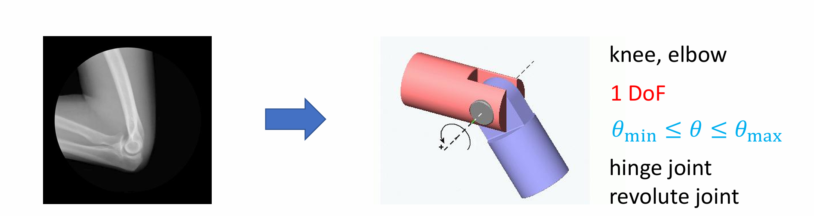
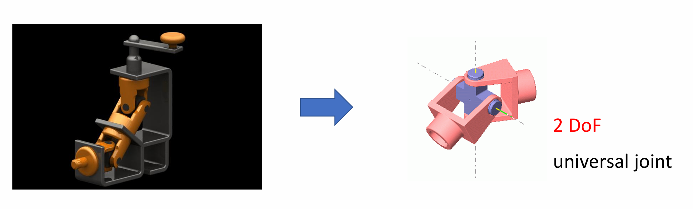
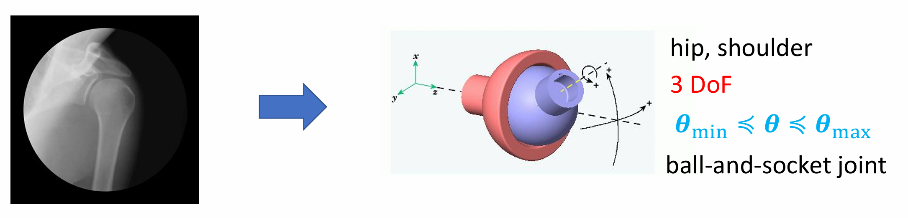
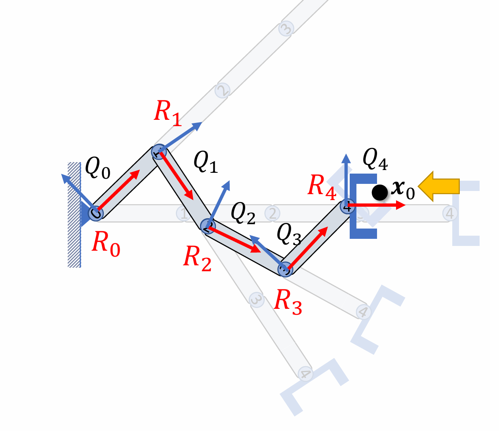
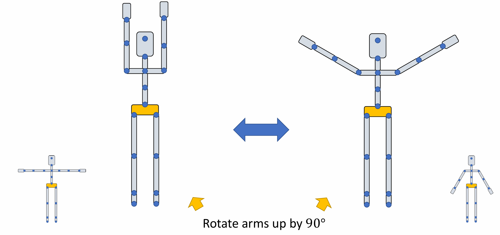
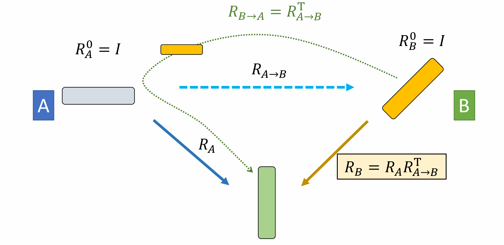
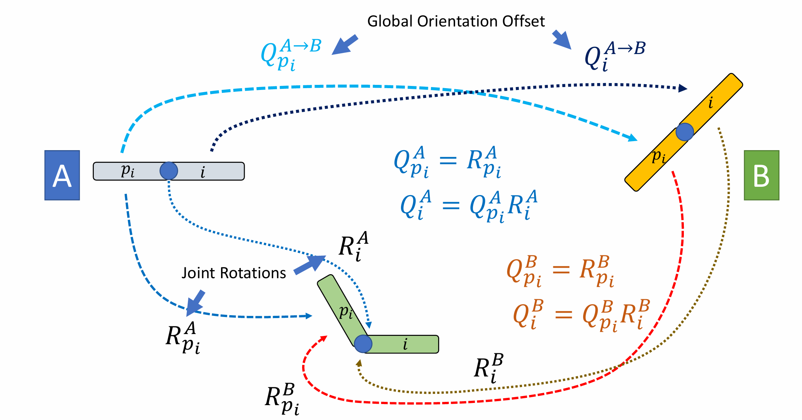
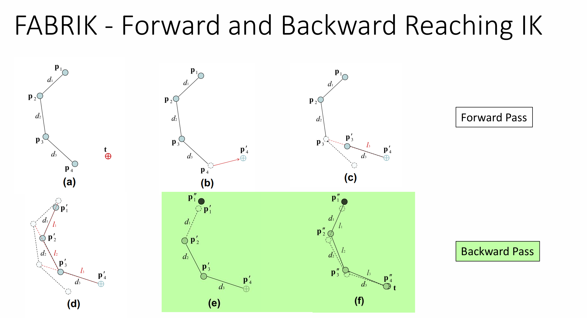
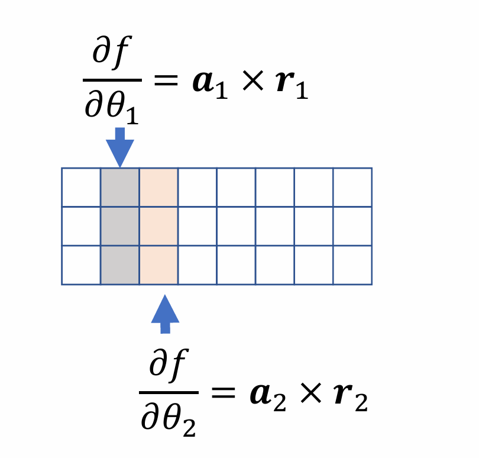
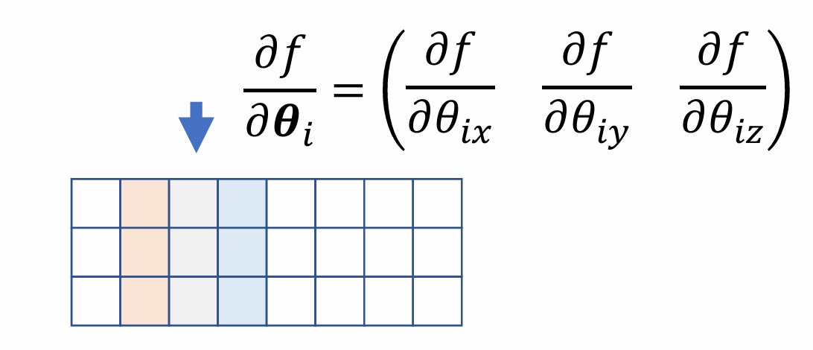

## 角色运动学基础

* **骨骼结构:** 角色模型通常由关节 (joint)、骨骼 (bone) 和链 (link) 组成。
* **自由度 (Degrees of Freedom, DoF):** 用于描述一个机械系统状态的独立参数个数。
  * **铰链关节 (Hinge/Revolute joint):** 例如膝盖和手肘，拥有 1 DoF，其旋转范围通常受限 ($\theta_{min} \le \theta \le \theta_{max}$)。
  * **万向节 (Universal joint):** 拥有 2 DoF。
  * **球窝关节 (Ball-and-socket joint):** 例如髋关节和肩部，拥有 3 DoF，旋转同样受限。

## 正向运动学

正向运动学是指在已知所有关节的旋转参数 $R_i$ 的情况下，计算末端执行器 (End Effector) 在全局坐标系下的位置 $x$。

### 公式推导
在机器人学或计算机图形学的链式结构中，通常涉及两种描述姿态的方式：
* **$R_i$ (Local Rotation / Relative Rotation):** 第 $i$ 个关节相对于前一个关节的**局部旋转**。
* **$Q_i$ (Global Orientation):** 第 $i$ 个关节相对于世界坐标系（全局）的**绝对朝向**。

通过逐级累乘局部旋转矩阵，可以得到每一级的全局朝向。

* **推导过程**
* $Q_0 = R_0$ （基座/起始点的朝向）
* $Q_1 = R_0 R_1 = Q_0 R_1$
* $Q_2 = R_0 R_1 R_2 = Q_1 R_2$
* $Q_3 = R_0 R_1 R_2 R_3 = Q_2 R_3$
* $Q_4 = R_0 R_1 R_2 R_3 R_4 = Q_3 R_4$

* **通项公式**
$$
Q_i = Q_{i-1} R_i
$$

如果我们已知各级的全局朝向，可以反求出局部旋转矩阵：

利用旋转矩阵的正交性（$Q^T = Q^{-1}$），从 $Q_i = Q_{i-1} R_i$ 可以推导出：
$$
R_i = Q_{i-1}^T Q_i
$$

### 任意两点间的相对旋转
如果需要计算链条中任意两个非相邻节点（例如节点 1 到节点 4）之间的相对旋转 $R_4^1$：

$$
\begin{aligned}
R_{4}^{1} &= Q_{1}^{T} Q_{4} \\
&= (R_{0} R_{1})^{T} R_{0} R_{1} R_{2} R_{3} R_{4} \\
&= R_{2} R_{3} R_{4}
\end{aligned}
$$

### 层级计算
* 计算各关节的全局旋转/朝向：
$$
Q_i = Q_{i-1} R_i
$$
* 计算各关节的全局位置：
$$
p_{i+1} = p_i + Q_i l_i
$$
* **末端执行器位置:**
$$
x = p_E + Q_E x_0
$$
（其中 $p_E$ 为末端关节位置，$Q_E$ 为其全局旋转，$x_0$ 为局部偏移量。）

### 总结

**已知条件：** 所有关节的旋转矩阵 $R_i$ 和连杆长度 $l_i$。  
**目标1：** 求解末端点 $x_0$ 在全局或局部参考系下的坐标 $x$。

* **方法 A：自底向上（从根节点到末端）**
    依次计算每一级的全局朝向 $Q_i$ 和位置 $p_i$：
    * **循环迭代：** 对 $i$ 从 $root$ 到 $end\_effector$：
        * $Q_i = Q_{i-1} R_i$
        * $p_{i+1} = p_i + Q_i l_i$
    * **最终坐标：** $x = p_E + Q_E x_0$
        *(其中 $p_E$ 和 $Q_E$ 分别为末端执行器的全局位置和朝向)*

* **方法 B：自顶向下（从末端到根节点）**
    通过递归变换直接累积坐标：
    * **初始化：** $x = x_0$
    * **循环迭代：** 对 $i$ 从 $end\_effector$ 到 $root$：
        * $x = l_{i-1} + R_i x$

**目标2：** 求解 $x_0$ 相对于局部坐标系 $Q_k$ (Local Frame) 的坐标

* **方法 A：局部增量法**
将 $Q_k$ 视为临时根节点（即 $Q'_0 = I, p'_0 = 0$）：
  * **循环迭代：** 对 $i$ 从 $joint \ k+1$ 到 $end\_effector$：
      * $Q'_i = Q'_{i-1} R_i$
      * $p'_{i+1} = p'_i + Q'_i l_i$
  * **相对坐标：** $x = p'_E + Q'_E x_0$

* **方法 B：局部递归法**
  * **初始化：** $x = x_0$
  * **循环迭代：** 对 $i$ 从 $end\_effector$ 到 $joint \ k+1$：
      * $x = l_{i-1} + R_i x$

## 角色姿态与参考系

* **Posed Character（摆好姿态的角色）：** 角色最终呈现的动作是由一系列局部旋转矩阵（如 $R_0, R_1, R_2, R_3$）作用于骨骼链的结果。
* **参考姿态 (Reference Poses)：** 制作模型和动画时的初始默认姿态。
    * **T-Pose：** 双臂平举，形似字母 "T"。
    * **A-Pose：** 双臂自然下垂，角度通常在 45° 左右，形似字母 "A"。

**核心矛盾：** 同样的动作指令（如“手臂向上旋转 90°”），在不同的参考姿态下，最终得到的全局效果完全不同。
* **示例：**

## 动作重定向

### 单物体的重定向

**核心任务：** 物体在姿态 A 为初始状态时的旋转为 $R_A$，求在姿态 B 下等效的旋转 $R_B$。

* **定义偏移：** 设从姿态 A 到姿态 B 的旋转偏移为 $R_{A \to B}$。
* **计算公式：**
    $$
    R_B = R_A R_{A \to B}^T
    $$
    *(这里 $R_{A \to B}^T$ 即 $R_{B \to A}$，用于抵消姿态 B 相对于 A 的初始偏角。)*

### 运动链的重定向

对于多节点链路，每一级都有其对应的**全局朝向偏移 (Global Orientation Offset)**，记为 $Q^{A \to B}$。

* **已知变量 (姿态 A)：**
  * $Q_{p_i}^A = R_{p_i}^A$ （父节点的全局朝向）
  * $Q_i^A = Q_{p_i}^A R_i^A$ （当前节点的全局朝向）

* **目标变量 (姿态 B)：**
    我们需要求解 $R_i^B$，使得在姿态 B 下应用该旋转后，物体在全局空间的效果与姿态 A 一致。

### 最终公式

根据单物体的结论 $Q^B = Q^A (Q^{A \to B})^T$，我们可以对父节点和当前节点分别写出转换关系：

1.  **父节点全局朝向转换：**
    $$
    Q_{p_i}^B = Q_{p_i}^A (Q_{p_i}^{A \to B})^T
    $$
2.  **当前节点全局朝向转换：**
    $$
    Q_i^B = Q_i^A (Q_i^{A \to B})^T
    $$

通过代入 $Q_i^B = Q_{p_i}^B R_i^B$，最终推导出重定向后的局部旋转矩阵公式：

$$
\mathbf{R_i^B = Q_{p_i}^{A \to B} R_i^A (Q_i^{A \to B})^T}
$$

## 逆向运动学

与 FK 相反，IK 是在已知末端执行器目标位置 $\tilde{x}$ 的前提下，反向求出使得系统达到该位置的各关节旋转参数 $\theta$。这是一个典型的非线性问题，可能存在唯一解、多解或无解的情况。

### 启发式方法

* **循环坐标下降法 (Cyclic Coordinate Descent, CCD):**
  * **原理:** 每次迭代中只旋转一个关节，使其末端指向目标位置，遍历所有轴循环执行。
  * **特点:** 易于实现且计算速度快。但靠近末端的关节（即首先被处理的关节）往往转动幅度过大，可能需要多次迭代才能收敛，且结果对初始解敏感。
* **FABRIK (Forward and Backward Reaching IK):**
  * **原理:** 一种基于位置的快速迭代求解器，包含前向（Forward）和后向（Backward）计算过程。
  * **特点:** 简单快速，且在无约束问题中保证收敛。
  
  

### 优化方法

将 IK 视为一个最优化问题，目标是寻找最优的参数 $\theta$ 来最小化误差函数：
$$F(\theta) = \frac{1}{2} \| f(\theta) - \tilde{x} \|_2^2$$

* **雅可比矩阵 (Jacobian Matrix):**
雅可比矩阵反映了末端执行器位置对各参数的偏导数：

    $$
    J = \frac{\partial f}{\partial \theta} = \begin{bmatrix} \frac{\partial f}{\partial \theta_0} & \frac{\partial f}{\partial \theta_1} & \cdots & \frac{\partial f}{\partial \theta_n} \end{bmatrix}
    $$
    （对于铰链关节，可以使用几何法直接计算：$\frac{\partial f}{\partial \theta_i} = \mathbf{a}_i \times \mathbf{r}_i$。）

* **梯度下降 / 雅可比转置法 (Jacobian Transpose):**
    $$
    \theta^{i+1} = \theta^i - \alpha J^T \Delta
    $$
    其中 $\Delta = f(\boldsymbol{\theta}^i) - \widetilde{\boldsymbol{x}}$ 为误差向量   
    这是一阶方法，不需要计算矩阵的逆，但收敛速度可能较慢。
    
    * 假设所有关节均为 **铰链关节 (Hinge joint / Revolute joint)**。
      * **$a_i$：** 第 $i$ 个关节的旋转轴向量。
      * **$r_i$：** 从第 $i$ 个关节指向末端执行器 $x$ 的位移向量。

      当第 $i$ 个关节旋转一个微小角度 $\delta \theta_i$ 时，末端点从 $x$ 移动到 $x'$，其位移向量由罗德里格斯公式给出：
      $$
      \boldsymbol{x}' - \boldsymbol{x} = (\sin \delta \theta_i) \boldsymbol{a}_i \times \boldsymbol{r}_i + (1 - \cos \delta \theta_i) \boldsymbol{a}_i \times (\boldsymbol{a}_i \times \boldsymbol{r}_i)
      $$

      为了得到雅可比矩阵中的第 $i$ 列，对角度取极限：
      $$
      \frac{\partial f}{\partial \theta_i} = \lim_{\delta \theta_i \to 0} \frac{\boldsymbol{x}' - \boldsymbol{x}}{\delta \theta_i}
      $$

      利用泰勒级数展开（当 $\delta \theta_i \to 0$ 时，$\sin \delta \theta_i \approx \delta \theta_i$ 且 $1 - \cos \delta \theta_i \approx 0$）：
      $$
      \mathbf{\frac{\partial f}{\partial \theta_i} = a_i \times r_i}
      $$
    
    * 对于球关节，个球关节会在雅可比矩阵中占用连续的三列。  
        设 $f$ 为末端执行器的位置函数，$\boldsymbol{\theta}_i = (\theta_{ix}, \theta_{iy}, \theta_{iz})^T$ 为球关节的三个旋转角。该关节对雅可比矩阵的贡献为：
        $$
        \frac{\partial f}{\partial \boldsymbol{\theta}_i} = \begin{bmatrix} \frac{\partial f}{\partial \theta_{ix}} & \frac{\partial f}{\partial \theta_{iy}} & \frac{\partial f}{\partial \theta_{iz}} \end{bmatrix}
        $$
        根据铰链关节的导数公式 $\frac{\partial f}{\partial \theta} = a \times r$，球关节的三列具体为：
        * 第一列： $a_{ix} \times r_i$ （绕 X 轴旋转产生的瞬时位移）
        * 第二列： $a_{iy} \times r_i$ （绕 Y 轴旋转产生的瞬时位移）
        * 第三列： $a_{iz} \times r_i$ （绕 Z 轴旋转产生的瞬时位移）  
        其中：  
        $a_{ix}, a_{iy}, a_{iz}$：分别为当前坐标系下三个正交的旋转轴向量。  
        $r_i$：从球关节中心指向末端执行器 $x$ 的位移矢量。  
        
        在将球关节拆解为三个铰链关节（绕 $x, y, z$ 轴）时，由于旋转是相继发生的，后面的旋转轴会受到前面旋转的影响。  
        为了计算雅可比矩阵，我们需要在全局坐标系下确定这三个轴向量：  
        * 第一轴（X轴）
            $$
            \boldsymbol{a}_{ix} = Q_{i-1}\boldsymbol{e}_x
            $$
            直接取前一级关节的全局朝向 $Q_{i-1}$ 作用于标准 $X$ 轴单位向量 $\boldsymbol{e}_x$。  
        * 第二轴（Y轴）： 
            $$
            \boldsymbol{a}_{iy} = Q_{i-1}R_{ix}\boldsymbol{e}_y
            $$
            该轴不仅受前一级朝向影响，还受本关节已经发生的 $X$ 轴旋转 $R_{ix}$ 的带动。  
        * 第三轴（Z轴）： 
            $$
            \boldsymbol{a}_{iz} = Q_{i-1}R_{ix}R_{iy}\boldsymbol{e}_z
            $$
            该轴受前一级朝向以及本关节已发生的 $X$ 轴和 $Y$ 轴旋转的双重带动。
* **高斯-牛顿法 / 雅可比求逆法 (Gauss-Newton / Jacobian Inverse):**  
    逆运动学的本质是寻找一组关节角 $\theta$，使得末端位置 $f(\theta)$ 与目标位置 $\widetilde{x}$ 的误差最小。通常定义最小二乘代价函数：
    $$
    F(\theta) = \frac{1}{2} \|f(\theta) - \widetilde{x}\|_2^2
    $$
    * 高斯-牛顿法 (Gauss-Newton Method)  
        通过对非线性函数 $f(\theta)$ 进行一阶泰勒展开，将非线性优化转化为线性子问题：  
        * 一阶近似： $f(\theta) \approx f(\theta^0) + J(\theta - \theta^0)$  
        * 代价函数近似： $F(\theta) \approx \frac{1}{2} \|f(\theta^0) + J(\theta - \theta^0) - \widetilde{x}\|_2^2$
        * 一阶最优条件 (KKT/正规方程)：
        $$
        J^T J (\theta - \theta^0) = -J^T \Delta
        $$
        其中 $\Delta = f(\theta^0) - \widetilde{x}$ 是当前的误差向量。  
        **局限性**：如果 $J^T J$ 是不可逆的（通常发生在雅可比矩阵 $J$ 为宽矩阵时，即自由度大于目标空间维度），则无法直接解出 $\theta$。  
    * 雅可比逆方法 (Jacobian Inverse Method)在机器人学中，我们通常面临冗余自由度问题，此时 $J$ 是扁平的。虽然 $J^T J$ 不可逆，但 $JJ^T$ 往往是可逆的。  
        上式两边同乘 $J$ ，并消去 $JJ^T$ ：
        $$
        J(\theta - \theta^0) = -\Delta
        $$
        最终更新公式：
        $$
        \theta = \theta^0 - J^+ \Delta
        $$
        其中 $J^+$ 称为 Moore-Penrose 伪逆 (Pseudoinverse)：
        $$
        \mathbf{J^+ = J^T(JJ^T)^{-1}}
        $$

    * 当我们要最小化误差函数 $F(\theta) = \frac{1}{2} \|f(\theta) - \widetilde{x}\|_2^2$ 时，最常用的迭代更新步长公式为：
        $$
        \theta = \theta^0 - \alpha J^+ \Delta
        $$
        * **$\alpha$**：步长（Learning Rate）。
        * **$\Delta$**：当前误差向量 $(f(\theta^0) - \widetilde{x})$。
        * **$J^+$**：雅可比矩阵的伪逆。

    * $J^+$ 的分类讨论：矩阵形态决定
      * **情况 A：冗余系统 (Underdetermined System)**
        * **特征：** $J$ 是“宽矩阵”（行数 < 列数），即机器人的自由度非常多，可以从无数种姿态中达到目标。
        * **公式：** 
            $$
            J^+ = J^T (JJ^T)^{-1}
            $$
        * **性质：** 此时 $JJ^T$ 是可逆的。这种解在所有可行解中，能使关节角度的变化量 $\|\theta - \theta^0\|$ 最小。

      * **情况 B：超定系统 (Overdetermined System)**
        * **特征：** $J$ 是“长矩阵”（行数 > 列数），通常出现在需要末端同时满足过多约束，而机器人自由度不足时。例如对多个关节的位置都有约束。
        * **公式：** 
          $$
          J^+ = (J^T J)^{-1} J^T
          $$
        * **性质：** 此时 $J^T J$ 是可逆的。这实际上就是经典最小二乘法的解。

    * **问题:** 当矩阵接近奇异时（例如手臂完全伸直的奇异位形），会导致计算不稳定。

* **阻尼雅可比求逆法 (Damped Jacobian Inverse):**

    在标准的伪逆法中，当机器人接近**奇异位姿**时，雅可比矩阵的逆（或伪逆）会变得趋于无穷大，导致关节跳变。 

    **阻尼法**通过在目标函数中引入一个“惩罚项”，限制关节旋转幅度，从而确保数值计算的稳定性。

    修改后的目标函数不再仅仅追求末端误差最小，同时要求**关节的变化量也要小**：
    $$
    F(\theta) = \frac{1}{2} \|f(\theta) - \widetilde{x}\|_2^2 + \frac{\lambda}{2} (\theta - \theta^i)^T W (\theta - \theta^i)
    $$

    * **第一项：** 末端位置误差。
    * **第二项 (阻尼项/正则项)：** 限制 $\theta$ 偏离当前值 $\theta^i$ 的程度。
    * **$\lambda$ (Damping parameter)：** 阻尼系数。$\lambda$ 越大，动作越平稳但收敛慢；$\lambda$ 越小，越接近标准伪逆法。
    * **$W$ (Weight matrix)：** 权重矩阵（通常是对角阵），用于为不同关节分配不同的重要性。

    根据矩阵形状的不同，计算公式中加入了阻尼项 $\lambda I$（或 $\lambda W$）：

    * **当 $J$ 为宽矩阵 (冗余系统)：**
    $$
    J^* = J^T (JJ^T + \lambda I)^{-1}
    $$
    * **当 $J$ 为长矩阵 (超定系统)：**
    $$
    J^* = (J^T J + \lambda I)^{-1} J^T
    $$

    **效果：** 通过加上 $\lambda I$，原本可能由于奇异而导致行列式为 0 的矩阵 $(JJ^T)$ 变得**强制可逆**，从而避免了数值爆炸。

    在接近极限位置时，机器人会表现得更加“保守”，宁愿保留一点点位置误差，也不愿让关节发生疯狂的瞬间甩动。
