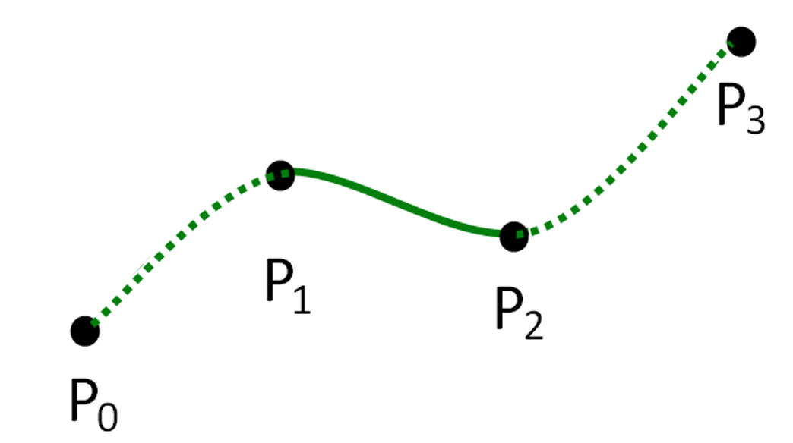

## 插值

参考[数值分析-函数的多项式插值（下）](../numerical-analysis-notes/03/)

在这里有一些其他的补充：

### Catmull-Rom Spline

**Catmull-Rom 样条**是一种常用的插值曲线，它通过一组控制点并确保在连接点处具有平滑的切线过渡（$C^1$ 连续性）。

曲线 $S(t)$ 在区间内可以表示为一个三次多项式：

$$
S(t) = at^3 + bt^2 + ct + d
$$

利用 **Hermite 插值基函数**，曲线可以表示为基函数向量与控制参数向量的乘积：

$$
S(t) = \begin{bmatrix} 2t^3 - 3t^2 + 1 \\ -2t^3 + 3t^2 \\ t^3 - 2t^2 + t \\ t^3 - t^2 \end{bmatrix}^T \begin{bmatrix} y_1 \\ y_2 \\ m_1 \\ m_2 \end{bmatrix}
$$

其中：

  * $y_1, y_2$ 是曲线段的**起点和终点**。
  * $m_1, m_2$ 是曲线在起点和终点的**斜率（切矢量）**。

Catmull-Rom 样条的关键特点是：某一点的斜率是由其**前一个点**和**后一个点**确定的。

根据图中定义，对于由 $P_0, P_1, P_2, P_3$ 四个控制点定义的中间段（$P_1$ 到 $P_2$）：

  * **端点赋值：**

      * $y_1 = p_1$
      * $y_2 = p_2$

  * **斜率（切线）计算：**

      * $m_1 = \frac{1}{2} \frac{p_2 - p_0}{x_2 - x_0}$
      * $m_2 = \frac{1}{2} \frac{p_3 - p_1}{x_3 - x_1}$

### 旋转的插值

回顾[球面线性插值 (SLERP)](./01#球面线性插值)

一些插值方法简介：

* **Catmull-Rom Euler（欧拉角插值）**

先将四元数转换为**欧拉角**（如 $Pitch, Yaw, Roll$），然后在欧拉角空间进行 Catmull-Rom 样条插值，最后转回四元数。
* **Catmull-Rom Axis-Angle（轴角插值）**

将旋转表示为**旋转轴和旋转角度**（Axis-Angle），在这一空间进行插值。
* **Piecewise Slerp（分段球面线性插值）**

在每两个关键帧之间直接进行 **Slerp（Spherical Linear Interpolation）**。
* **TCB Interp（TCB 样条插值 / Kochanek-Bartels Spline）**

在四元数空间（通常是单位球面上）引入 **Tension（张力）、Continuity（连续性）和 Bias（偏移）** 三个参数来控制切线。

### 双线性插值

* **计算过程**：
    1.  **水平方向**：在两对端点间插值，求出中间值 $m_2$ 和 $m_4$。
        * $m_2 = (1-s)p_{11} + sp_{21}$
        * $m_4 = (1-s)p_{12} + sp_{22}$
    2.  **垂直方向**：在 $m_2$ 和 $m_4$ 之间进行最后的混合。
        * $x = (1-t)m_2 + tm_4$

### 双三次插值

不仅考虑目标点周围的 4 个点，而是扩展到 **16 个 (4x4)** 邻近像素点。

在两个方向上均使用三次多项式（Cubic Polynomial）进行拟合。

### 2D 三角形插值
对于三角形 $ABC$ 内的点 $P$，其位置由三个顶点的加权平均决定：

$$
P = w_a A + w_b B + w_c C
$$

其中权重（重心坐标）满足 $w_a + w_b + w_c = 1$。

权重计算（面积比法）：每个顶点的权重等于其对边三角形与总面积的比值。

* $w_a = \frac{\Delta PBC}{\Delta ABC}$

* $w_b = \frac{\Delta PCA}{\Delta ABC}$

* $w_c = \frac{\Delta PAB}{\Delta ABC}$

### 3D 四面体插值

对于空间中的四面体 $ABCD$ 内的点 $P$，原理同理扩展：

$$
P = w_a A + w_b B + w_c C + w_d D
$$

权重计算（体积比法）：每个顶点的权重等于该点与相对面构成的子四面体体积与总面积之比。

### 离散数据插值

离散数据插值旨在通过一组不规则分布的数据点，构建一个连续的函数表面。常见的方法包括：
* **线性插值 (Linear)**：包括最小二乘法 (Least squares)。
* **样条插值 (Splines)**。
* **反距离权重法 (Inverse distance weighting)**。
* **高斯过程 (Gaussian process)**。
* **径向基函数 (Radial Basis Function, RBF)**。

### 径向基函数插值

RBF 插值的基本思想是将插值函数 $y$ 表示为一组基函数的加权线性组合：

$$
y = \sum_{i=1}^{K} w_i \varphi(\| \mathbf{x} - \mathbf{x}_i \|)
$$

* $\mathbf{x}$：待求点的坐标。
* $\mathbf{x}_i$：已知数据点（中心点）的坐标。
* $\| \mathbf{x} - \mathbf{x}_i \|$：待求点到已知点之间的欧几里得距离。
* $\varphi$：径向基函数（只依赖于距离的函数）。
* $w_i$：对应基函数的权重。

为了确定权重，我们需要满足插值条件，即在已知点 $\mathbf{x}_i$ 处的函数值必须等于观测值 $y_i$（即 $f(\mathbf{x}_i) = y_i$）。这可以转化为一个线性方程组：

$$
\begin{bmatrix}
R_{1,1} & R_{1,2} & \cdots & R_{1,K} \\
R_{2,1} & R_{2,2} & \cdots & R_{2,K} \\
\vdots & \vdots & \ddots & \vdots \\
R_{K,1} & \cdots & \cdots & R_{K,K}
\end{bmatrix}
\begin{bmatrix}
w_1 \\
w_2 \\
\vdots \\
w_K
\end{bmatrix}
=
\begin{bmatrix}
y_1 \\
y_2 \\
\vdots \\
y_K
\end{bmatrix}
$$

其中，矩阵元素定义为：

$$
R_{i,j} = \varphi(\| \mathbf{x}_i - \mathbf{x}_j \|)
$$

* **常见的径向基函数 $\varphi(r)$ 类型**

  假设 $r$ 是点与点之间的距离 $\| \mathbf{x} - \mathbf{x}_i \|$：

  | 类型 | 数学表达式 $\varphi(r)$ |
  | :--- | :--- |
  | **Gaussian (高斯)** | $e^{-(r/c)^2}$ |
  | **Inverse multiquadric (反多二次项)** | $\frac{1}{\sqrt{r^2 + c^2}}$ |
  | **Thin plate spline (薄板样条)** | $r^2 \log r$ |
  | **Polyharmonic splines (多谐样条)** | $\begin{cases} r^k, & k=2n+1 \\ r^k \log r, & k=2n \end{cases}$ |
