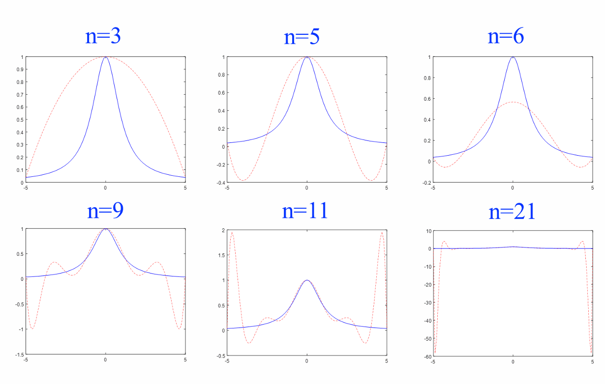

## Hermite 插值多项式

### 三次 Hermite 插值
给定两个节点 $x_0, x_1$，我们需要构造一个三次多项式 $H_3(x)$，使其满足以下 4 个条件：
* **函数值条件**：$H_3(x_0) = y_0, \quad H_3(x_1) = y_1$
* **导数值条件**：$H_3'(x_0) = m_0, \quad H_3'(x_1) = m_1$

为了表达 $H_3(x)$，我们构造四种基函数 $\alpha_0(x), \alpha_1(x), \beta_0(x), \beta_1(x)$，它们的取值特性如下表：

| 基函数 | $x_0$ 处的函数值 | $x_1$ 处的函数值 | $x_0$ 处的导数值 | $x_1$ 处的导数值 |
| :--- | :---: | :---: | :---: | :---: |
| $\alpha_0(x)$ | **1** | 0 | 0 | 0 |
| $\alpha_1(x)$ | 0 | **1** | 0 | 0 |
| $\beta_0(x)$ | 0 | 0 | **1** | 0 |
| $\beta_1(x)$ | 0 | 0 | 0 | **1** |

**最终结构**：
$$H_3(x) = y_0 \alpha_0(x) + y_1 \alpha_1(x) + m_0 \beta_0(x) + m_1 \beta_1(x)$$

构造：

* **函数值基函数**：
  $$
  \alpha_0(x) = \left( 1 + \frac{2(x - x_0)}{x_1 - x_0} \right) \left[ \frac{x - x_1}{x_0 - x_1} \right]^2
  $$
  $$
  \alpha_1(x) = \left( 1 + \frac{2(x - x_1)}{x_0 - x_1} \right) \left[ \frac{x - x_0}{x_1 - x_0} \right]^2
  $$
* **导数值基函数**：
  $$
  \beta_0(x) = (x - x_0) \left[ \frac{x - x_1}{x_0 - x_1} \right]^2
  $$
  $$
  \beta_1(x) = (x - x_1) \left[ \frac{x - x_0}{x_1 - x_0} \right]^2
  $$

当 $f(x) \in C^4[a, b]$ 时，三次 Hermite 插值的阶段误差为：

$$
R(x) = f(x) - H_3(x) = \frac{f^{(4)}(\xi)}{4!} (x - x_0)^2 (x - x_1)^2, \quad \xi \in (a, b)
$$

### 一般形式的 Hermite 插值

给定 $n+1$ 个相异节点 $x_0, x_1, \dots, x_n$，构造一个 $2n+1$ 次多项式 $H_{2n+1}(x)$，使其满足：
$$H_{2n+1}(x_i) = f(x_i), \quad H'_{2n+1}(x_i) = f'(x_i) \quad (i=0, 1, \dots, n)$$

公式结构为：
$$H_{2n+1}(x) = \sum_{i=0}^{n} [a_i(x) f(x_i) + \beta_i(x) f'(x_i)]$$

利用 **Lagrange 插值基函数 $l_i(x)$** 及其导数 $l'_i(x_i)$ 进行构造。

* **函数值基函数 $\alpha_i(x)$**
    设 $\alpha_i(x) = (ax + b)l_i^2(x)$，通过满足条件 $\alpha_i(x_i)=1$ 和 $\alpha'_i(x_i)=0$，求得系数：
    * **表达式**：$\alpha_i(x) = [1 - 2l'_i(x_i)(x - x_i)]l_i^2(x)$
    * 其中 $l'_i(x_i) = \sum_{j=0, j \neq i}^{n} \frac{1}{x_i - x_j}$。

* **导数值基函数 $\beta_i(x)$**
    设 $\beta_i(x) = C(x - x_i)l_i^2(x)$，通过满足条件 $\beta'_i(x_i)=1$，求得 $C=1$：
    * **表达式**：$\beta_i(x) = (x - x_i)l_i^2(x)$

设 $f(x) \in C^{(2n+2)}[a, b]$，则对于任意 $x \in [a, b]$，存在 $\xi \in (a, b)$ 使得插值余项为：

$$
\begin{aligned}
R_{2n+1}(x) &= f(x) - H_{2n+1}(x) \\
&= \frac{f^{(2n+2)}(\xi)}{(2n+2)!} (x - x_0)^2 (x - x_1)^2 \dots (x - x_n)^2 \\
&= \frac{f^{(2n+2)}(\xi)}{(2n+2)!} \omega_{n+1}^2(x)
\end{aligned}
$$

## 分段低次插值

### 龙格现象
考察函数 $f(x) = \frac{1}{1+x^2}$ 在区间 $[-5, 5]$ 上的插值。

* **现象描述**：随着插值节点数 $n$ 的增大（多项式次数升高），插值多项式 $L_n(x)$ 仅在区间中心附近收敛。在**端点附近**，多项式会出现剧烈的抖动（摆动），误差反而迅速增大。

* **本质**：高次多项式对局部数据的变化过于敏感，容易在边缘产生不稳定的震荡。

除了龙格现象外，高次插值还存在以下问题：
1. **计算量大**：插值次数越高，公式越复杂，计算工作量呈指数级增长。
2. **误差积累**：高次多项式的每一项系数计算都涉及多次乘除，舍入误差容易堆积。

### 分段线性插值

给定区间 $[a, b]$ 上的节点 $a = x_0 < x_1 < \dots < x_n = b$ 及其函数值 $f(x_i) = y_i$。
**分段线性插值函数 $I_h(x)$** 满足：
1. $I_h(x) \in C[a, b]$（在整个区间上连续）。
2. 在每个小区间 $[x_i, x_{i+1}]$ 上，$I_h(x)$ 是一个线性多项式（一次函数）。
3. 满足插值条件：$I_h(x_i) = y_i \quad (i=0, 1, \dots, n)$。

在每个局部区间 $[x_i, x_{i+1}]$ 上，利用 Lagrange 一次插值公式：
$$
I_h(x) = \frac{x - x_{i+1}}{x_i - x_{i+1}} y_i + \frac{x - x_i}{x_{i+1} - x_i} y_{i+1}, \quad x \in [x_i, x_{i+1}]
$$

设 $f \in C^2[a, b]$，$I_h(x)$ 为 $f(x)$ 的分段线性插值多项式，则对于 $x \in [x_i, x_{i+1}]$，其误差为：
$$
|f(x) - I_h(x)| \leqslant \frac{M_2}{8} (x_{i+1} - x_i)^2
$$
其中 $M_2 = \max_{a \leqslant x \leqslant b} |f''(x)|$。

若记最大步长 $h = \max_i (x_{i+1} - x_i)$，则全区间上的误差界为：
$$
\|f - I_h\|_\infty = \max_{a \leqslant x \leqslant b} |f(x) - I_h(x)| \leqslant \frac{M_2}{8} h^2
$$

### 分段三次 Hermite 插值

**添加一阶导数插值条件**，用来克服分段线性插值在节点处不可导（有尖角）的问题。

已知节点 $x_0, x_1, \dots, x_n$ 及其对应的**函数值** $y_k$ 和**导数值** $m_k$。
若函数 $I_h(x)$ 满足：
1. **一阶连续**：$I_h(x) \in C^1[a, b]$（不仅曲线连续，切线也连续）。
2. **完全匹配**：$I_h(x_k) = f_k, \quad I'_h(x_k) = m_k$。
3. **分段三次**：在每个小区间 $[x_k, x_{k+1}]$ 上，$I_h(x)$ 是一个三次多项式。

在单个区间 $[x_k, x_{k+1}]$ 上，利用局部基函数构造：
$$
I_h(x) = y_k \alpha_k(x) + y_{k+1} \alpha_{k+1}(x) + m_k \beta_k(x) + m_{k+1} \beta_{k+1}(x)
$$

* **函数值基函数**
$$
\alpha_k(x) = \left( 1 + 2\frac{x - x_k}{x_{k+1} - x_k} \right) \left( \frac{x - x_{k+1}}{x_k - x_{k+1}} \right)^2
$$

$$
\alpha_{k+1}(x) = \left( 1 + 2\frac{x_{k+1} - x}{x_{k+1} - x_k} \right) \left( \frac{x - x_k}{x_{k+1} - x_k} \right)^2
$$

* **导数值基函数**
$$
\beta_k(x) = (x - x_k) \left( \frac{x - x_{k+1}}{x_k - x_{k+1}} \right)^2
$$

$$
\beta_{k+1}(x) = (x - x_{k+1}) \left( \frac{x - x_k}{x_{k+1} - x_k} \right)^2
$$

与分段线性插值类似，全区间上的函数可以表示为：
$$
I_h(x) = \sum_{i=0}^{n} [f_i \alpha_i(x) + m_i \beta_i(x)]
$$

若 $f(x) \in C^4[a, b]$，记 $M_4 = \max |f^{(4)}(x)|$，则误差界为：
$$
|f(x) - I_h(x)| \leqslant \frac{h^4}{384} M_4
$$

## 三次样条插值

### 定义
若函数 $S(x)$ 满足以下三个条件，则称其为三次样条插值函数：
1. **二阶连续性**：$S(x) \in C^2[a, b]$，即在整个区间上具有连续的一阶和二阶导数（曲线非常光滑）。
2. **插值性**：$S(x_k) = f_k, \quad k=0, 1, \dots, n$。
3. **分段三次**：在每个小区间 $[x_k, x_{k+1}]$ 上，$S(x)$ 是一个三次多项式。

相比分段三次 Hermite 插值，样条插值**不需要知道原函数的导数值**，它通过自身的平滑要求（二阶导数连续）自动计算出所需的导数。

### 自由度分析
在 $n$ 个小区间上，每个区间有 4 个系数 $(a_k, b_k, c_k, d_k)$，总共有 **$4n$ 个待定系数**。

**约束条件统计：**
* **内部节点连续性**：在 $n-1$ 个内部节点处，函数值、一阶导、二阶导均需连续，共 $3(n-1)$ 个条件。
* **插值条件**：$n+1$ 个节点处必须经过已知点，共 $n+1$ 个条件。
* **总计条件数**：$3n - 3 + n + 1 = 4n - 2$ 个。

方程数比未知数少 2 个，因此必须额外补充 **2 个边界条件** 才能得到唯一解。

| 类型 | 边界条件名称 | 具体描述 | 公式表达 |
| :--- | :--- | :--- | :--- |
| **(a)** | **固支边界** | 已知两端点的一阶导数（斜率）。 | $S'(x_0) = f'_0, \ S'(x_n) = f'_n$ |
| **(b)** | **简支边界** | 已知两端点的二阶导数（弯矩）。 | $S''(x_0) = f''_0, \ S''(x_n) = f''_n$ |
| **(c)** | **周期边界** | 首尾节点的函数值及各阶导数相等。 | $S^{(i)}(x_0) = S^{(i)}(x_n), \ i=0, 1, 2$ |

给定区间 $[a, b]$ 上的函数值及上述任一种边界条件，则在全区间上**存在唯一的**三次样条插值函数 $S(x)$。

### 三弯矩法

三次样条函数 $S(x)$ 的表达式有多种形式，但在实际计算中，使用**二阶导数值** $S''(x_i) = M_i \ (i=0, 1, \dots, n)$ 来表示更为方便。

* **力学解释**：$M_i$ 在物理上可以解释为细梁在节点 $x_i$ 处的**弯矩**（Bending Moment）。
* **算法名称**：由于推导出的方程组中，每一个点的弯矩只与相邻的两个弯矩有关（形成三对角关系），故称为**三弯矩算法**。
