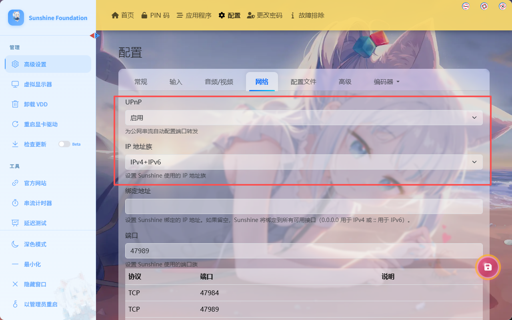
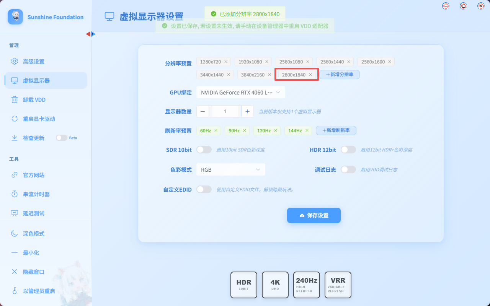
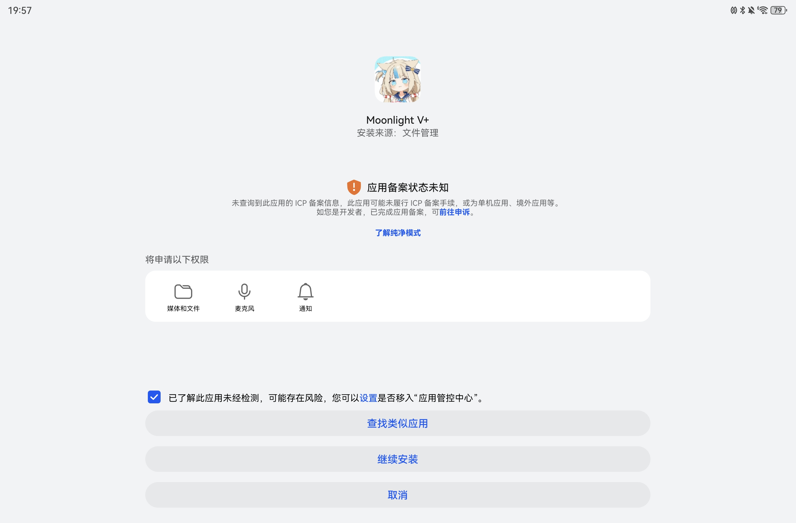
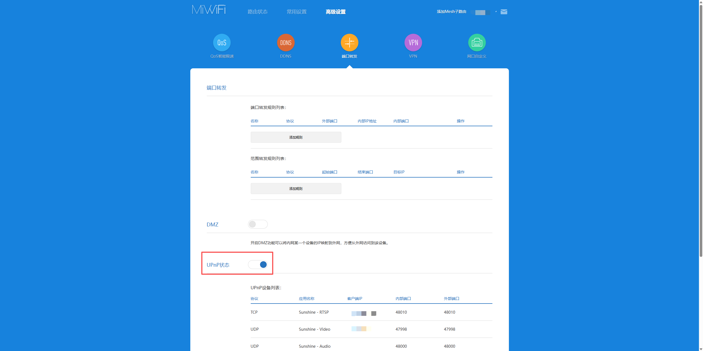
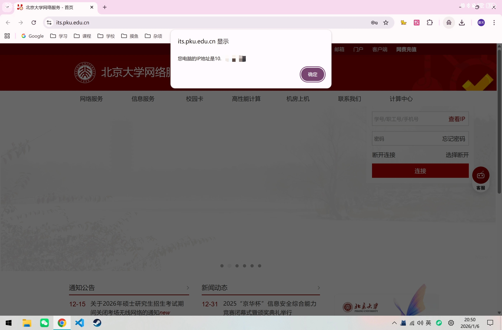
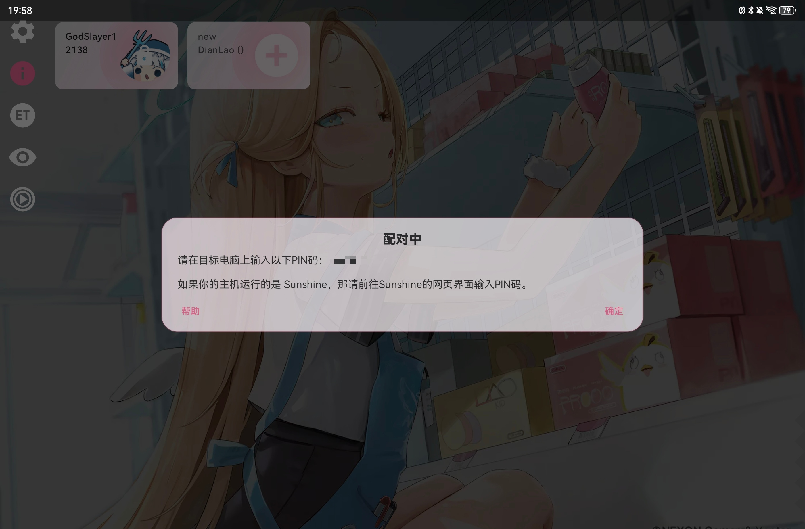
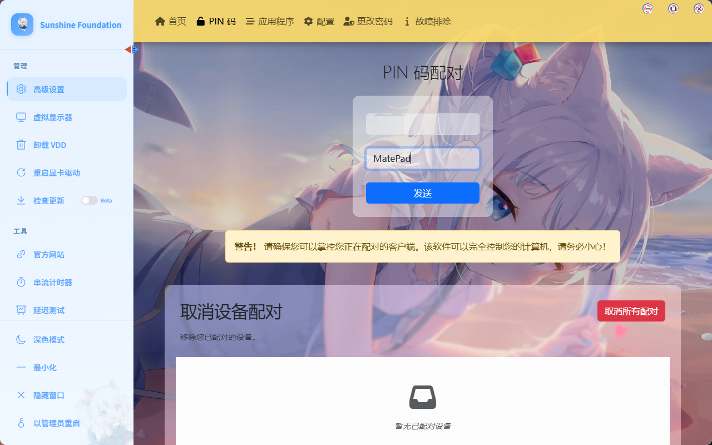
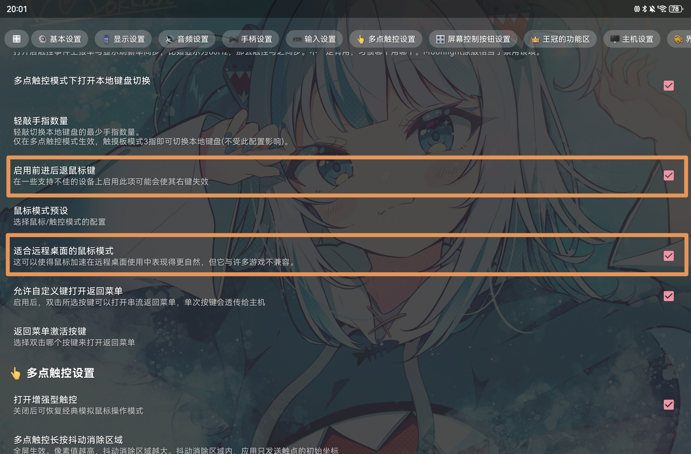

## 前言
主播实在忍受不了游戏本的超级重量与超级垃圾续航，正巧25年暑假购入了一台平板，机缘巧合下刷到了局域网串流的介绍视频，发现校园网环境下可以进行串流，配置好后可以把笔记本放宿舍当台式吃灰，每天只用带着平板出门就可以享受电脑操作系统的使用体验，近乎无限的续航。
本指南写于26年1月，主播重装系统后从零开始进行串流配置，结合第一次配置的种种踩坑经历，整理出了一套最简单的方案，希望能帮后来者节省一些时间🥰。
本指南的配置方案基于视频[【串流教程】全网最好的串流教程，没有之一](https://www.bilibili.com/video/BV13i421r7Ff)，并结合了p大校园网环境进行改进。推荐各位先看一眼视频。当然如果你懒得看视频，也可以直接看下面正文当省流。

---

## 工具介绍
选择`sunshine` + `moonlight`经典日月组合，这里主播以`基地版 sunshine`和`威力加强版 moonlight`为例介绍。它们都属于第三方魔改版，有一些原版没有的功能。基地版自带虚拟显示屏，安装后电脑会有一个虚拟显示屏，实际通过这块“屏幕”进行串流，这样可以关闭物理显示屏的输出，再也不用担心室友窥屏啦😛。

- [基地版 sunshine](https://github.com/qiin2333/foundation-sunshine)
- [威力加强版 moonlight](https://github.com/qiin2333/moonlight-vplus)

## 校园网相关
p大校园网存在子网隔离。如果服务端和客户端同时连接PKU Secure，那么两台设备在不同子网段是不能连接的。体现为 PC 和平板同时在宿舍里可以成功串流，但是把平板拿到教学楼就不行了。这也是大部分人（包括一开始的主播）串流失败的原因。~~本文完结。~~ 而我们的 PC 可以通过插网线或通过宿舍的路由器联网，来解决这个问题。主播采用的是路由器方案，具体方案请往下看。

## 服务端配置（你的PC）
### 安装
[基地版 sunshine 下载](https://github.com/qiin2333/foundation-sunshine/releases)。注意勾选安装虚拟显示器，有个虚拟麦克风看个人，可装可不装。
### 配置
在网络一栏，这两个选项如图设置：

虚拟显示器里面，把你客户端的显示器分辨率和刷新率加进来，主播的 MatePad 分辨率是 2800 * 1840。

## 客户端配置（你的移动设备）
### 安装
[威力加强版 moonlight 下载](https://github.com/qiin2333/moonlight-vplus/releases)。下载 apk 并无视风险继续安装。

### 配置
客户端这块不需要太多设置，等着配对就行。先往下看：

## 路由器设置
以小米路由器为例，进入路由器设置页面，找到 UPnP 设置并开启。

连网线的话，可以跳过这一步。

## 配对
最关键的一步，决定你的串流能否成功！
核心在于使用学校提供给电脑的 ip 地址。
在电脑上打开[北京大学网络服务](https://its.pku.edu.cn/)，查看 ip 地址：

然后在 moonlight 上输入这个 ip 进行查找。查找到后就可以进行配对啦：

输入 PIN 码即可。

至此，你已经成功完成了串流，并且人在教学楼也可以连上在宿舍的电脑了🎉。

## 个性化
最后列一下个人觉得比较有用的小设置：

- 平板用的键盘上面不一定支持 win 键，启用这个设置可以让你在平板也可以输入 win 键。

- 启用鼠标侧键，极大提高刷网页的体验。主播表示离开侧键已经完全不会用电脑或打游戏了。
- 适合远程桌面的的鼠标模式。开启这个后鼠标好像会更跟手一点，暂时不知道啥原理，但还是开着吧。
